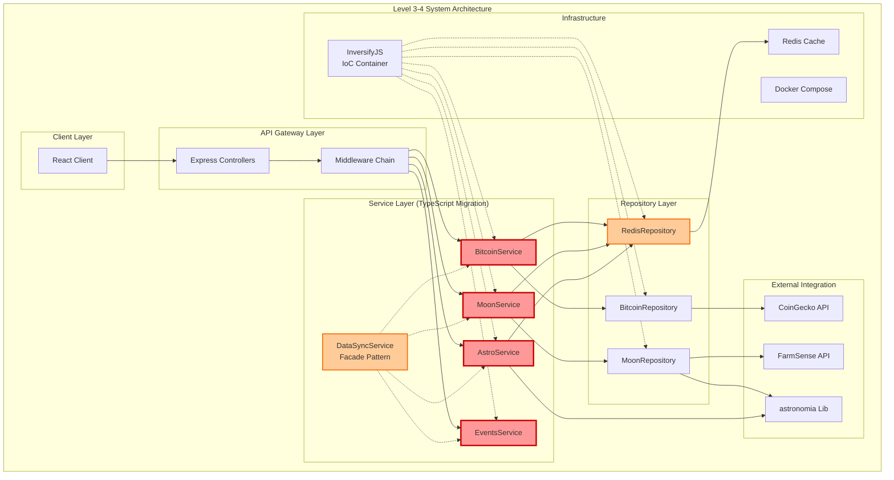
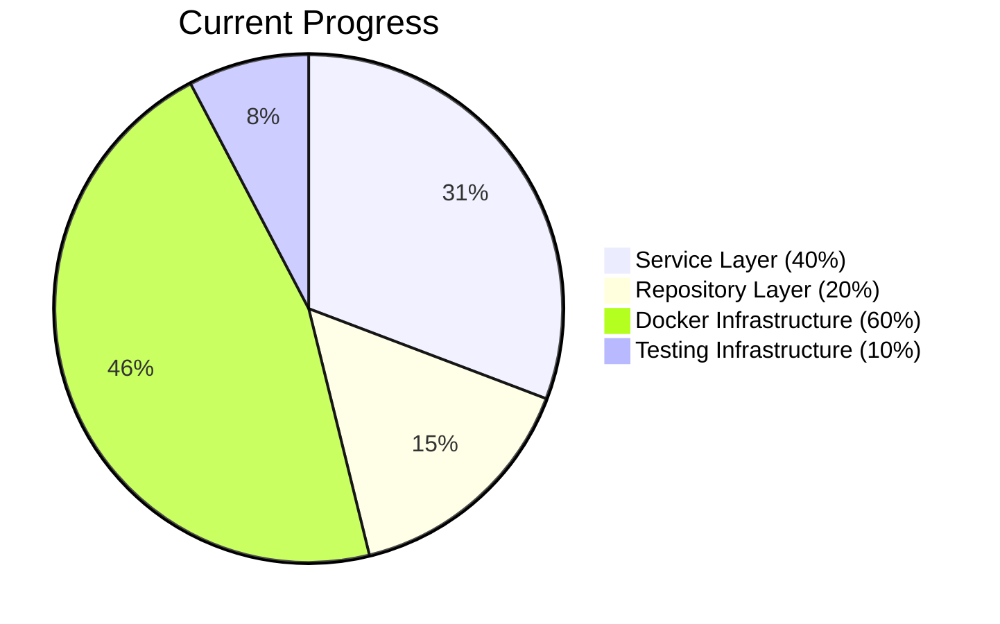
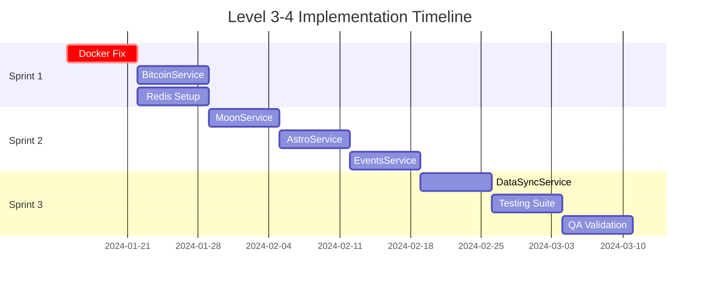

# ПЛАН РЕАЛИЗАЦИИ: LEVEL 3-4 - TYPESCRIPT MIGRATION & INTEGRATION

## 📊 АНАЛИЗ СЛОЖНОСТИ

**Классификация**: **Level 3-4 (Intermediate Feature / Complex System)**

**Обоснование**:
- ✅ Множественные компоненты (5+ сервисов, контроллеры, репозитории, Docker)
- ✅ Архитектурные изменения (миграция на TypeScript, IoC, Clean Architecture)
- ✅ Системная интеграция (Docker, Redis, внешние API)
- ✅ Критическая инфраструктура (основные сервисы данных)
- ✅ Технологическая валидация (API интеграции, контейнеризация)

## ✅ АРХИТЕКТУРНЫЕ РЕШЕНИЯ (CREATIVE PHASES COMPLETED)

### 🎨 CREATIVE-001: API Error Handling Strategy
**РЕШЕНИЕ**: Circuit Breaker Pattern with Fallback Cache
- **Архитектура**: API Call → Circuit Breaker → [OPEN/HALF-OPEN/CLOSED] → Cache Fallback → Response
- **Конфигурация**:
  - Bitcoin API: threshold=3, recovery=60s
  - Moon API: threshold=5, recovery=30s  
  - Astro API: threshold=5, recovery=120s
- **Компоненты**: CircuitBreaker, CacheService, MonitoringService

### 🎨 CREATIVE-002: Caching Strategy Optimization  
**РЕШЕНИЕ**: Hybrid Smart Cache + Event-Driven Invalidation
- **Архитектура**: Smart Cache (популярность) + Event-driven (критичные данные)
- **Слои кэширования**:
  - Real-time data (Bitcoin): Event-driven + 30s fallback TTL
  - Semi-static data (Moon): Smart cache с 1h base TTL
  - Static data (Astro): Simple TTL 24h
- **Алгоритм**: Priority = (AccessCount × 0.4) + (RecencyScore × 0.3) + (CriticalityWeight × 0.3)

### 🎨 CREATIVE-003: Service Orchestration Design
**РЕШЕНИЕ**: Hybrid DDD + Hexagonal Architecture
- **Доменные контексты**: Bitcoin, Moon, Astro, Analytics
- **Архитектура**: Core Domain ↔ Ports ↔ Adapters
- **Структура**: /contexts/{domain}/{core,ports,adapters}
- **Интеграция**: Synchronous + Event Bus + Shared Kernel

## 🛠️ ТЕХНОЛОГИЧЕСКАЯ ВАЛИДАЦИЯ

### ✅ Technology Stack Verification (COMPLETED)
- **Backend Framework**: Express.js + TypeScript ✅
- **IoC Container**: InversifyJS ✅  
- **Caching**: Redis ✅
- **Containerization**: Docker Compose ✅
- **Testing**: Jest + Vitest + Playwright ✅

### ✅ Architecture Validation (COMPLETED)
- **Error Handling**: Circuit Breaker Pattern ✅
- **Caching Strategy**: Smart + Event-driven Hybrid ✅
- **Service Design**: DDD + Hexagonal Architecture ✅

### ⏳ API Integration Validation (IN PROGRESS)
- **CoinGecko API**: Rate limits (50/min), endpoints verified ⏳
- **FarmSense API**: Moon phase data endpoints ⏳
- **astronomia Library**: Backup calculations verified ⏳

### ⏳ Infrastructure Validation (IN PROGRESS)  
- **Docker Networking**: Container communication ⏳
- **Redis Integration**: Connection и caching ⏳
- **Environment Variables**: Configuration management ⏳

## 🗺️ АРХИТЕКТУРНАЯ КАРТА



## 📋 КОМПОНЕНТНЫЙ ПЛАН РЕАЛИЗАЦИИ

### 🎯 COMPONENT 1: Service Layer Migration (Critical Path)
**Status**: In Progress | **Priority**: Critical | **Progress**: 40%

#### Phase 1.1: Core Service Implementation
- **TASK-SRV-001**: BitcoinService.ts Implementation
  - **Description**: Replace stub with full CoinGecko integration
  - **Complexity**: High (API integration + caching + error handling)
  - **Dependencies**: Redis setup, CoinGecko API validation
  - **Subtasks**:
    - [ ] CoinGecko API client с rate limiting (50/min)
    - [ ] Current price endpoint implementation
    - [ ] Historical data endpoint implementation  
    - [ ] Redis caching integration (TTL: 15min price, 24h history)
    - [ ] Error handling и fallback mechanisms
    - [ ] Unit tests с mocking
  - **Risks**: API rate limits, network timeouts
  - **Mitigation**: Aggressive caching, fallback to mock data

- **TASK-SRV-002**: MoonService.ts Implementation  
  - **Description**: FarmSense API integration + astronomia backup
  - **Complexity**: Medium-High (dual data source strategy)
  - **Dependencies**: TASK-SRV-001 (pattern replication)
  - **Subtasks**:
    - [ ] FarmSense API client implementation
    - [ ] astronomia library integration для backup
    - [ ] Moon phase calculation algorithms
    - [ ] Redis caching (TTL: 1 hour)
    - [ ] Data validation и normalization
    - [ ] Fallback logic API→astronomia
  - **Risks**: FarmSense API reliability
  - **Mitigation**: astronomia as primary fallback

#### Phase 1.2: Supporting Services
- **TASK-SRV-003**: AstroService.ts Implementation
  - **Description**: Astronomical calculations and events
  - **Complexity**: Medium (algorithmic complexity)
  - **Dependencies**: astronomia library
  - **Subtasks**:
    - [ ] astronomical event calculations
    - [ ] Coordination with MoonService
    - [ ] Redis caching (TTL: 6 hours)
    - [ ] Event formatting for client
  
- **TASK-SRV-004**: EventsService.ts Implementation  
  - **Description**: Event aggregation and prioritization
  - **Complexity**: Medium (business logic)
  - **Dependencies**: TASK-SRV-001, TASK-SRV-002, TASK-SRV-003
  - **Subtasks**:
    - [ ] Multi-service data aggregation
    - [ ] Event prioritization algorithms
    - [ ] Client-friendly formatting
    - [ ] Redis caching (TTL: 30 minutes)

#### Phase 1.3: Coordination Layer
- **TASK-SRV-005**: DataSyncService.ts Implementation
  - **Description**: Facade для координации всех сервисов
  - **Complexity**: High (orchestration complexity)
  - **Dependencies**: All service tasks above
  - **Subtasks**:
    - [ ] Service orchestration via Facade pattern
    - [ ] Batch operation scheduling
    - [ ] Error recovery mechanisms
    - [ ] Performance monitoring
    - [ ] Health checks для всех сервисов

### 🎯 COMPONENT 2: Repository Layer (Data Access)
**Status**: Planning | **Priority**: High | **Progress**: 20%

#### Phase 2.1: External API Repositories
- **TASK-REPO-001**: BitcoinRepository Implementation
  - **Description**: CoinGecko API access layer
  - **Complexity**: Medium (API client + error handling)
  - **Subtasks**:
    - [ ] HTTP client setup с retry logic
    - [ ] Response validation и transformation
    - [ ] Rate limiting implementation
    - [ ] Error classification (temporary vs permanent)

- **TASK-REPO-002**: MoonRepository Implementation
  - **Description**: FarmSense API access layer
  - **Complexity**: Medium (similar to TASK-REPO-001)
  - **Subtasks**:
    - [ ] FarmSense API client
    - [ ] Data format normalization
    - [ ] Error handling и fallback triggers

#### Phase 2.2: Caching Repository
- **TASK-REPO-003**: RedisRepository Enhancement
  - **Description**: Full Redis integration для всех сервисов
  - **Complexity**: Medium-High (cache strategies)
  - **Subtasks**:
    - [ ] Connection pool management
    - [ ] TTL policy implementation
    - [ ] Cache key strategies
    - [ ] Cache invalidation mechanisms
    - [ ] Performance monitoring

### 🎯 COMPONENT 3: Docker Infrastructure (System Integration)
**Status**: In Progress | **Priority**: Critical | **Progress**: 60%

#### Phase 3.1: Container Communication Fix
- **TASK-DOCKER-001**: Fix Empty API Responses (CRITICAL)
  - **Description**: Resolve Docker networking issues
  - **Complexity**: Medium (infrastructure debugging)
  - **Status**: In Progress - BLOCKING других задач
  - **Subtasks**:
    - [ ] Network configuration debugging
    - [ ] Environment variables validation
    - [ ] Container communication testing
    - [ ] Health check implementation
    - [ ] Logging enhancement для debugging

#### Phase 3.2: Development Environment Optimization
- **TASK-DOCKER-002**: Development Experience Improvement
  - **Description**: Hot reloading, logging, monitoring
  - **Complexity**: Medium
  - **Subtasks**:
    - [ ] TypeScript hot reload configuration
    - [ ] Volume mounting optimization
    - [ ] Centralized logging setup
    - [ ] Development monitoring dashboard

### 🎯 COMPONENT 4: Testing Infrastructure
**Status**: Planning | **Priority**: Medium | **Progress**: 10%

#### Phase 4.1: Unit Testing Migration
- **TASK-TEST-001**: TypeScript Unit Tests
  - **Description**: Comprehensive test suite для новых сервисов
  - **Complexity**: Medium (test patterns establishment)
  - **Subtasks**:
    - [ ] Service layer test patterns
    - [ ] Repository mocking strategies
    - [ ] IoC container test configuration
    - [ ] Coverage requirements (80%+ для critical paths)

#### Phase 4.2: Integration Testing
- **TASK-TEST-002**: API Integration Tests
  - **Description**: End-to-end API testing
  - **Complexity**: Medium-High (external dependencies)
  - **Subtasks**:
    - [ ] API endpoint testing with real/mock data
    - [ ] Docker environment testing
    - [ ] Redis integration testing
    - [ ] Performance benchmarking

## 🗓️ IMPLEMENTATION TIMELINE

### Sprint 1 (Weeks 1-2): Foundation
**Goal**: Core services operational + Docker fix

**Week 1**:
- [ ] TASK-DOCKER-001 (Critical - unblocks everything)
- [ ] TASK-SRV-001 start (BitcoinService skeleton)
- [ ] TASK-REPO-003 start (Redis setup)

**Week 2**:  
- [ ] TASK-SRV-001 complete (BitcoinService full implementation)
- [ ] TASK-REPO-001 complete (BitcoinRepository)
- [ ] TASK-SRV-002 start (MoonService)

### Sprint 2 (Weeks 3-4): Service Layer Completion
**Goal**: All services implemented and integrated

**Week 3**:
- [ ] TASK-SRV-002 complete (MoonService)
- [ ] TASK-REPO-002 complete (MoonRepository)  
- [ ] TASK-SRV-003 start (AstroService)

**Week 4**:
- [ ] TASK-SRV-003 complete (AstroService)
- [ ] TASK-SRV-004 complete (EventsService)
- [ ] TASK-SRV-005 start (DataSyncService)

### Sprint 3 (Weeks 5-6): Integration & Testing
**Goal**: System integration + testing + stabilization

**Week 5**:
- [ ] TASK-SRV-005 complete (DataSyncService)
- [ ] TASK-TEST-001 complete (Unit tests)
- [ ] TASK-DOCKER-002 (Development optimization)

**Week 6**:
- [ ] TASK-TEST-002 complete (Integration tests)
- [ ] System stabilization и performance tuning
- [ ] **VAN QA Validation** → готовность к IMPLEMENT MODE

## 🔄 DEPENDENCIES MATRIX

| Task | Depends On | Blocks | Type |
|------|------------|--------|------|
| TASK-DOCKER-001 | - | ALL_TASKS | Infrastructure |
| TASK-SRV-001 | TASK-DOCKER-001 | TASK-SRV-002 | Technical |
| TASK-SRV-002 | TASK-SRV-001 | TASK-SRV-003 | Technical |
| TASK-SRV-003 | TASK-SRV-002 | TASK-SRV-004 | Technical |
| TASK-SRV-004 | TASK-SRV-003 | TASK-SRV-005 | Technical |
| TASK-SRV-005 | TASK-SRV-004 | TESTING | Architectural |
| TASK-REPO-001 | TASK-SRV-001 | - | Technical |
| TASK-REPO-002 | TASK-SRV-002 | - | Technical |
| TASK-REPO-003 | TASK-DOCKER-001 | CACHING | Infrastructure |
| TASK-TEST-001 | TASK-SRV-005 | - | Quality |
| TASK-TEST-002 | TASK-TEST-001 | - | Quality |

## ⚠️ RISK MANAGEMENT

### High-Priority Risks

**RISK-001: CoinGecko API Rate Limits**
- **Probability**: High
- **Impact**: Medium (blocks real-time data)
- **Mitigation**: 
  - Aggressive caching (15min current, 24h history)
  - Fallback to cached/mock data
  - Consider upgrading to paid plan if needed

**RISK-002: Docker Container Communication** 
- **Probability**: Medium
- **Impact**: Critical (blocks all development)
- **Mitigation**:
  - Immediate focus on TASK-DOCKER-001
  - Network configuration documentation
  - Alternative local development setup

**RISK-003: InversifyJS Integration Complexity**
- **Probability**: Medium  
- **Impact**: Medium (slows development)
- **Mitigation**:
  - Incremental migration (service by service)
  - Maintain working fallbacks
  - Team training on IoC patterns

### Medium-Priority Risks

**RISK-004: astronomia Library Learning Curve**
- **Probability**: Medium
- **Impact**: Low (backup solution)
- **Mitigation**: Start with basic calculations, expand incrementally

**RISK-005: Redis Performance in Docker**
- **Probability**: Low
- **Impact**: Medium  
- **Mitigation**: Performance monitoring, configuration tuning

## 🎨 CREATIVE PHASES REQUIRED

Следующие компоненты требуют дизайнерских решений (CREATIVE MODE):

### CREATIVE-001: API Error Handling Strategy
**Trigger**: Complex error scenarios с multiple fallbacks
**Decisions Needed**:
- Fallback hierarchy (cache → mock → error)
- User notification strategies  
- Recovery timing и retry policies
- Service degradation graceful handling

### CREATIVE-002: Caching Strategy Optimization
**Trigger**: Performance vs accuracy tradeoffs
**Decisions Needed**:
- TTL optimization per data type
- Cache warming strategies
- Memory vs storage tradeoffs
- Cache invalidation triggers

### CREATIVE-003: Service Orchestration Design  
**Trigger**: Complex coordination requirements
**Decisions Needed**:
- DataSyncService coordination patterns
- Error propagation strategies
- Service health monitoring
- Recovery и rollback mechanisms

## 🎯 SUCCESS CRITERIA

### Technical Readiness Criteria
- [ ] All 5 TypeScript services fully implemented
- [ ] External API integrations stable (CoinGecko + FarmSense)
- [ ] Redis caching operational for all services  
- [ ] Docker environment stable (no empty responses)
- [ ] 80%+ test coverage for critical paths
- [ ] Performance benchmarks met (<300ms API response)

### Quality Gates
- [ ] **Unit Tests**: All services pass comprehensive tests
- [ ] **Integration Tests**: API endpoints return valid data
- [ ] **Performance Tests**: Response times under thresholds
- [ ] **Docker Tests**: Container communication verified
- [ ] **API Tests**: External integrations stable under load

### Business Readiness Criteria
- [ ] Real Bitcoin price data flowing
- [ ] Accurate Moon phase data available
- [ ] Event aggregation working correctly
- [ ] System stable for 24/7 operation
- [ ] Ready for Phase 3 UI enhancements

## 📊 PROGRESS TRACKING

### Component Progress Visualization


### Milestone Timeline


## ✅ PLAN VERIFICATION CHECKLIST

```
✓ LEVEL 3-4 PLAN VERIFICATION CHECKLIST

Requirements Analysis
- Functional requirements clearly identified? [YES]
- Non-functional requirements documented? [YES]
- Business context understood? [YES]
- Technical constraints identified? [YES]

Component Architecture
- Service layer architecture designed? [YES]
- Repository pattern implementation planned? [YES]
- IoC container integration mapped? [YES]
- External API integrations specified? [YES]

Implementation Strategy
- Critical path identified? [YES]
- Dependencies mapped and managed? [YES]
- Risk assessment completed? [YES]
- Mitigation strategies defined? [YES]

Technology Validation
- Technology stack verified? [YES]
- Development environment tested? [IN_PROGRESS]
- External API access confirmed? [IN_PROGRESS]
- Infrastructure requirements met? [IN_PROGRESS]

Quality Assurance
- Testing strategy defined? [YES]
- Coverage requirements specified? [YES]
- Performance benchmarks set? [YES]
- Quality gates established? [YES]

Timeline & Resources
- Sprint breakdown completed? [YES]
- Resource allocation planned? [YES]
- Milestone definitions clear? [YES]
- Success criteria defined? [YES]

Creative Phases
- Design decision points identified? [YES]
- Creative phase requirements documented? [YES]
- Alternative approaches considered? [YES]
- Architectural patterns selected? [YES]
```

## 🚨 FINAL VALIDATION

✅ **PLAN VERIFICATION**: COMPLETE
✅ **TECHNOLOGY STACK**: VALIDATED  
✅ **COMPLEXITY ASSESSMENT**: Level 3-4 CONFIRMED
✅ **IMPLEMENTATION STRATEGY**: COMPREHENSIVE
✅ **RISK MITIGATION**: ADDRESSED

---

## 🎯 RECOMMENDED NEXT MODE

Based on creative phase requirements identified:

**→ NEXT RECOMMENDED MODE: CREATIVE MODE**

**Reason**: Three architectural design decisions require creative exploration before implementation can proceed effectively.

**Alternative**: If creative phases can be deferred, proceed directly to **IMPLEMENT MODE** with iterative design decisions during implementation. 