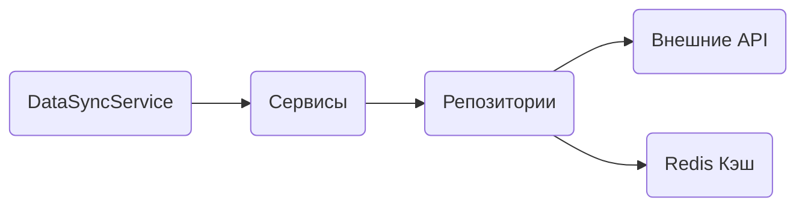
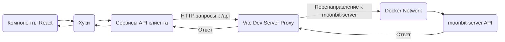

# System Patterns

## System architecture

Проект разделен на клиентскую и серверную части, следуя принципам SPA архитектуры:

- **Клиент (Frontend)**: React приложение с функциональными компонентами и хуками
- **Сервер (Backend)**: Express.js API на TypeScript с чистой архитектурой

## Организация кода

### Стандарты кода и файлов

1. **Форматы файлов**:

   - **Серверная часть**: Все файлы используют TypeScript (.ts)
   - **Клиентская часть**: React компоненты используют JavaScript с JSX (.jsx) или TypeScript с TSX (.tsx)

2. **Именование файлов**:

   - **TypeScript файлы**: camelCase для утилит, хуков, репозиториев; PascalCase для классов и сервисов.
   - **React компоненты**: PascalCase для компонентных файлов (.jsx/.tsx)

3. **Именование переменных и функций**:
   - camelCase для переменных и функций
   - PascalCase для классов и компонентов React
   - UPPER_SNAKE_CASE для констант

## Серверная архитектура

### Слои приложения

1. **Контроллеры**: Обрабатывают HTTP-запросы и ответы
2. **Сервисы**: Содержат бизнес-логику приложения, используют IoC-контейнер для инъекции зависимостей.
3. **Репозитории**: Отвечают за доступ к данным (API, кэш, БД), используются сервисами.
4. **Типы**: Определения TypeScript для моделей данных и интерфейсов.
5. **Утилиты**: Вспомогательные функции и инструменты

### Архитектурные принципы

- **Чистая архитектура**: Разделение на слои с четкими зависимостями
- **Инъекция зависимостей**: Использование IoC-контейнера (InversifyJS) для управления зависимостями.
- **Паттерн репозитория**: Абстракция доступа к данным (API, Redis)
- **Принципы SOLID**: Применяются для улучшения структуры кода.

## Клиентская архитектура

1. **Компоненты**: Переиспользуемые UI элементы
2. **Сервисы**: Взаимодействие с API (настроено проксирование через Vite в Dockerized среде)
3. **Хуки**: Управление состоянием и бизнес-логикой
4. **Утилиты**: Вспомогательные функции

## Инфраструктура и среда разработки

- **Docker Compose**: Используется для локальной разработки, оркестрирует клиентский, серверный и Redis контейнеры.
- **Redis**: Сервис кэширования для серверной части, работает в отдельном Docker контейнере.
- **Vite**: Сборщик клиента, настроен для проксирования API-запросов к серверу в Docker-сети.
- **Jest**: Фреймворк для тестирования серверной части.
- **Vitest**: Фреймворк для тестирования клиентской части.

## Будущие оптимизации

1. **Полная интеграция Redis**: Внедрение во все сервисы для кэширования.
2. **Отложенные интеграции**:
   - Сложные интеграции с внешними API будут внедряться поэтапно
   - Начальная разработка ведется с использованием моковых данных
3. **WebSocket**: Будет использован для real-time данных позже

## Component relationships

- **Контроллеры → Сервисы → Репозитории**: основной поток данных
- **Сервисы могут использовать другие сервисы** для сложных операций (через инъекцию зависимостей)
- **DataSyncService** координирует обновление данных из разных источников (использует сервисы)

# Системные паттерны MoonBit

## Архитектурные принципы

### Общая архитектура

Приложение построено по принципам клиент-серверной архитектуры:

- **Бэкенд**: REST API на Node.js + Express + TypeScript
- **Фронтенд**: SPA на React + Vite
- **Кэширование**: Redis
- **Оркестрация локальной разработки**: Docker Compose

### Разделение ответственности

- **Клиент**: отвечает за отображение данных и взаимодействие с пользователем
- **Сервер**: отвечает за обработку запросов, получение данных из внешних API, валидацию и кэширование (с использованием Redis)

## Ключевые паттерны проектирования

### Серверная часть (TypeScript)

#### Сервисный слой (Service Layer)

- Каждая функциональная область выделена в отдельный сервис (BitcoinService, MoonService, AstroService, EventsService)
- Сервисы инкапсулируют всю бизнес-логику и взаимодействие с внешними API
- Реализованы как классы с использованием декораторов InversifyJS для инъекции зависимостей (@injectable(), @inject())

```typescript
// Пример: Сервис с инъекцией зависимостей
@injectable()
export class BitcoinService {
  constructor(
    @inject(TYPES.BitcoinRepository) private bitcoinRepository: IBitcoinRepository,
    @inject(TYPES.Logger) private logger: ILogger
  ) {}
  // Методы и свойства
}
```

#### Фасад (Facade)

- DataSyncService выступает фасадом, координирующим работу других сервисов
- Скрывает сложность взаимодействия между различными компонентами
- Предоставляет единую точку входа для синхронизации данных

```typescript
// Пример: Фасад для синхронизации данных
@injectable()
export class DataSyncService {
  constructor(
    @inject(TYPES.BitcoinService) private bitcoinService: IBitcoinService,
    // ... другие сервисы
  ) {}

  async syncAll(): Promise<void> {
    await Promise.all([
      this.bitcoinService.updatePriceData(),
      // ... вызовы других сервисов
    ]);
  }
}
```

#### Middleware (Chain of Responsibility)

- Обработка запросов через цепочку middleware (логирование, валидация, обработка ошибок)
- Каждое middleware решает одну конкретную задачу

```typescript
// Пример: Цепочка middleware в Express
app.use(cors(config.cors));
app.use(express.json());
app.use(requestLogger);
// Маршруты
app.use('/api', apiRoutes);
app.use(notFoundHandler);
app.use(errorHandler);
```

#### Repository

- Репозитории отвечают за взаимодействие с источниками данных (внешние API, Redis)
- Сервисы используют репозитории для получения и сохранения данных
- Используются классы с инъекцией зависимостей

```typescript
// Пример: Repository для Redis
@injectable()
export class RedisRepository {
  private redisClient: Redis;

  constructor(@inject(TYPES.RedisClient) redisClient: Redis) {
    this.redisClient = redisClient;
  }

  async getData(key: string): Promise<string | null> {
    return this.redisClient.get(key);
  }

  async setData(key: string, value: string, ttl?: number): Promise<void> {
    if (ttl) {
      await this.redisClient.setex(key, ttl, value);
    } else {
      await this.redisClient.set(key, value);
    }
  }
}
```

### Клиентская часть (React, Vite, Docker)

#### Компонентная архитектура

- UI разделен на переиспользуемые компоненты (функциональные, с хуками)
- Компоненты имеют четкую ответственность и минимальную связанность

#### Контейнер / Презентационные компоненты

- Компоненты разделены на контейнеры (содержат логику, используют хуки для данных/API) и презентационные (отображение данных, получают через props)
- Dashboard является контейнером, внутри которого находятся презентационные компоненты

#### Композиция компонентов

- Построение сложных компонентов через композицию более простых
- Использование `children` для гибкой структуры

```jsx
// Пример: Композиция через children
<ErrorBoundary>
  <Dashboard>
    <CurrentPrice />
    <MoonPhaseDisplay />
  </Dashboard>
</ErrorBoundary>
```

#### Хуки (Hook Pattern)

- Использование React-хуков (`useState`, `useEffect`, `useContext`)
- Создание пользовательских хуков для повторного использования логики (`useBitcoinPrice`, `useUpcomingEvents`)

```typescript
// Пример: Пользовательский хук на TypeScript
function useBitcoinPrice(currency: string = 'usd'): IBitcoinPrice | null {
  const [price, setPrice] = useState<IBitcoinPrice | null>(null);

  useEffect(() => {
    // Логика получения цены через API сервис
  }, [currency]);

  return price;
}
```

## Взаимодействие между компонентами

### Серверная часть (TypeScript, Docker)

#### API-маршруты и контроллеры

```mermaid
graph LR
    Client(Клиент) --> |HTTP запросы| Nginx(Обратный прокси / Vite Dev Server Прокси)
    Nginx --> |Перенаправление /api| DockerNetwork(Docker Network)
    DockerNetwork --> Server(moonbit-server)
    Server --> |Express Router| API_Routes(Маршруты API)
    API_Routes --> Controllers(Контроллеры)
    Controllers --> Services(Сервисы)
    Services --> Repositories(Репозитории)
    Repositories --> |Внешние API| ExternalAPI(CoinGecko, FarmSense)
    Repositories --> |Кэш| Redis(Redis Container)
    Redis <--> Services
    Services --> Services # Сервисы могут взаимодействовать друг с другом

    subgraph Server_Internal [Серверная часть в Docker]
        API_Routes
        Controllers
        Services
        Repositories
    end

    subgraph Docker_Compose [Docker Compose]
        Client
        Server_Internal
        Redis
        DockerNetwork
    end
```

#### Фоновая синхронизация данных



### Клиентская часть (React, Vite, Docker)

#### Получение и отображение данных


