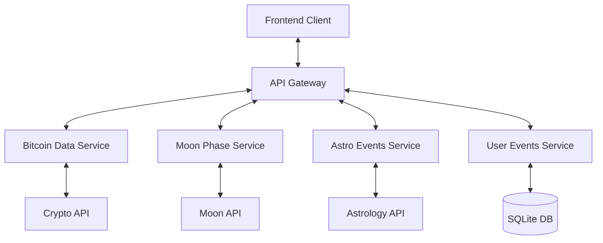
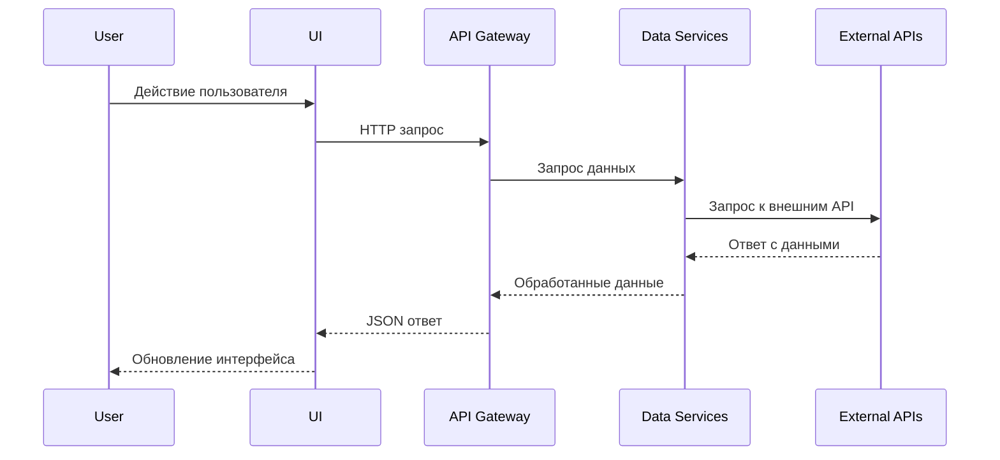
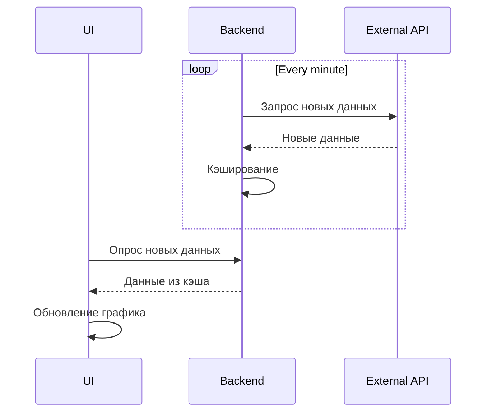

# Системные паттерны проекта "Биткоин и Луна"

## Архитектура системы

### Общая архитектура
Проект использует стандартную клиент-серверную архитектуру с четким разделением ответственности:

### Frontend
Frontend реализован с использованием компонентной архитектуры и следующих принципов:

1. **Atomic Design**: Компоненты организованы по принципу атомарного дизайна
   - Atoms: базовые UI элементы (кнопки, инпуты, иконки)
   - Molecules: комбинации атомов (форма добавления события)
   - Organisms: функциональные блоки (график, панель событий)
   - Templates: организация организмов на странице
   - Pages: конкретные реализации шаблонов

2. **Container/Presenter Pattern**: Разделение компонентов на:
   - Контейнеры (умные компоненты): управляют данными и состоянием
   - Презентационные компоненты: отвечают за отображение UI

### Backend
Backend реализован с использованием следующих принципов:

1. **Service Layer Pattern**: Выделение бизнес-логики в отдельные сервисы
2. **Repository Pattern**: Абстракция доступа к данным
3. **Middleware Pattern**: Использование промежуточных обработчиков для кросс-катящей функциональности
4. **Proxy Cache Pattern**: Кэширование запросов к внешним API

## Ключевые технические решения

### Работа с данными
1. **Polling vs WebSockets**: Использование регулярного опроса (polling) для получения данных о биткоине с интервалом не менее 1 минуты для соблюдения лимитов API
2. **Data Normalization**: Преобразование данных из разных источников в единый формат для удобства использования
3. **Incremental Loading**: Подгрузка исторических данных по мере необходимости

### Обработка событий
1. **Event Sourcing**: Хранение пользовательских событий в хронологическом порядке
2. **Command Query Responsibility Segregation (CQRS)**: Разделение операций чтения и записи

### Синхронизация данных
1. **Eventual Consistency**: Обеспечение согласованности данных со временем
2. **Optimistic UI**: Немедленное отображение изменений в UI с последующей синхронизацией с бэкендом

## Используемые дизайн-паттерны

### Frontend
1. **Observer Pattern**: Реактивное обновление UI при изменении данных
2. **Factory Pattern**: Создание и настройка графиков и визуализаций
3. **Adapter Pattern**: Адаптация данных из разных источников в единый формат
4. **Strategy Pattern**: Разные стратегии для отображения данных в зависимости от временного интервала

### Backend
1. **Proxy Pattern**: Кэширование запросов к внешним API
2. **Singleton Pattern**: Используется для сервисов подключения к БД и настройки логирования
3. **Decorator Pattern**: Добавление функциональности к базовым сервисам
4. **Chain of Responsibility**: Обработка запросов через цепочку middleware

## Взаимодействия компонентов

### Потоки данных

### Обновление данных в реальном времени
