# 🏗️ MoonBit - Архитектура системы

> **Comprehensive guide** по архитектуре и техническим решениям проекта MoonBit

## 📋 Содержание

- [🎯 Обзор архитектуры](#-обзор-архитектуры)
- [🌐 Frontend архитектура](#-frontend-архитектура)
- [🚀 Backend архитектура](#-backend-архитектура)
- [💾 Data Layer](#-data-layer)
- [🔄 Communication patterns](#-communication-patterns)
- [🧩 Component design](#-component-design)
- [📊 State management](#-state-management)
- [🔒 Security architecture](#-security-architecture)
- [⚡ Performance considerations](#-performance-considerations)
- [🧪 Testing architecture](#-testing-architecture)

---

## 🎯 Обзор архитектуры

**MoonBit** построен на основе **современной микросервисной архитектуры** с четким разделением ответственности между frontend, backend и data layer.

### 📊 **High-level архитектурная диаграмма**

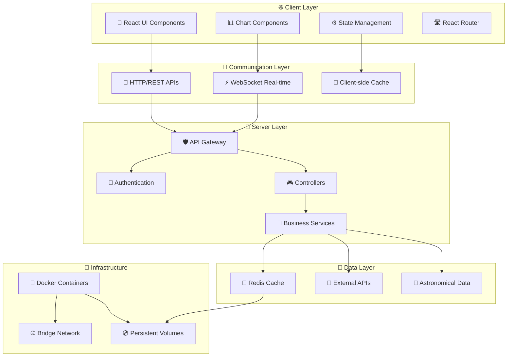

### 🏛️ **Архитектурные принципы**

| Принцип | Реализация | Преимущества |
|---------|------------|--------------|
| **Separation of Concerns** | Frontend/Backend/Data разделение | Независимое развитие компонентов |
| **Dependency Injection** | Inversify контейнер | Testability и loose coupling |
| **Single Responsibility** | Service-based architecture | Maintainability и modularity |
| **Interface Segregation** | TypeScript interfaces | Type safety и clear contracts |
| **Don't Repeat Yourself** | Shared utilities и components | Code reusability |

---

## 🌐 Frontend архитектура

### 📱 **React Application Structure**

```
src/
├── components/           # Reusable UI components
│   ├── atoms/           # Basic building blocks  
│   ├── organisms/       # Complex composed components
│   ├── BitcoinChart/    # Chart-specific components
│   └── Dashboard/       # Page-level components
├── services/            # API communication layer
├── utils/               # Helper functions и utilities
├── types/               # TypeScript type definitions
└── main.jsx            # Application entry point
```

### 🧩 **Component Architecture Pattern**

MoonBit использует **Atomic Design Pattern** для организации React компонентов:

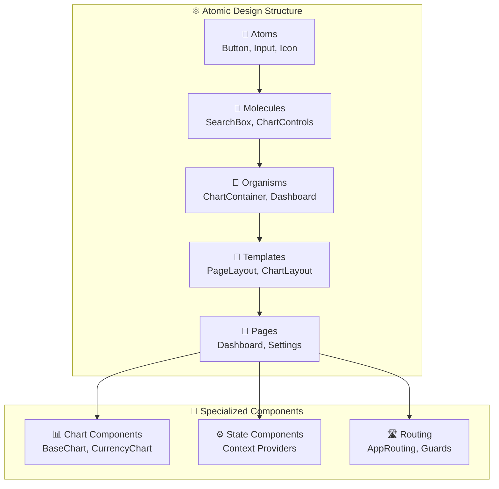

### 📊 **Chart Architecture**

**Lightweight Charts integration** с memory management:

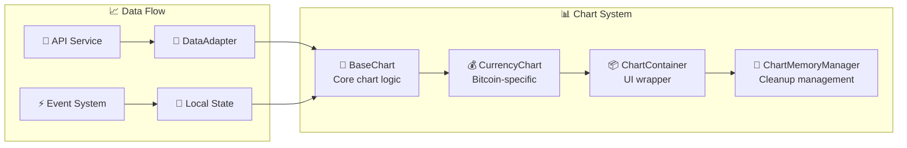

### ⚙️ **State Management Architecture**

**Context + Custom Hooks pattern** для state management:

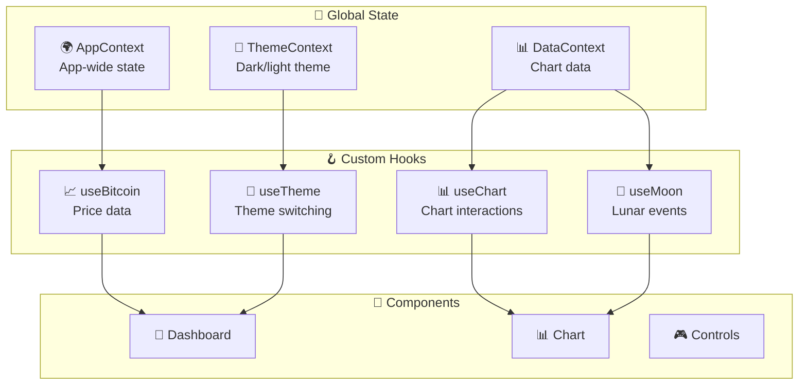

---

## 🚀 Backend архитектура

### 🏗️ **Server Architecture Overview**

```
src/
├── controllers/         # Request handling logic
│   ├── BitcoinController.ts
│   ├── MoonController.ts
│   └── EventsController.ts
├── services/           # Business logic layer
│   ├── BitcoinService.ts
│   ├── MoonService.ts
│   └── AstroService.ts
├── repositories/       # Data access layer
│   ├── BitcoinRepository.ts
│   └── MoonRepository.ts
├── routes/            # Express route definitions
├── utils/             # Helper utilities
└── types/             # TypeScript definitions
```

### 🧬 **Dependency Injection Architecture**

**Inversify container** для управления dependencies:

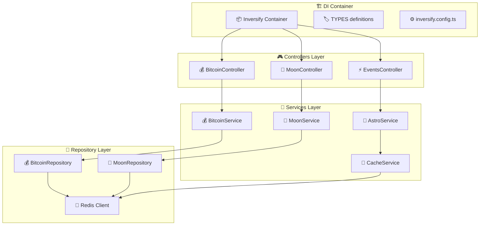

### 🔌 **Service Layer Architecture**

Каждый service реализует **specific business domain**:

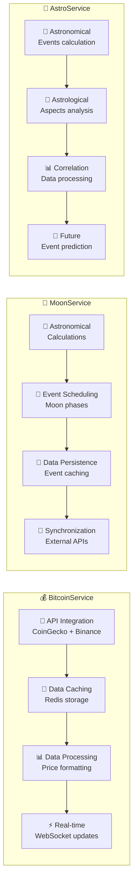

---

## 💾 Data Layer

### 🔴 **Redis Cache Architecture**

**Redis** используется как primary caching layer:

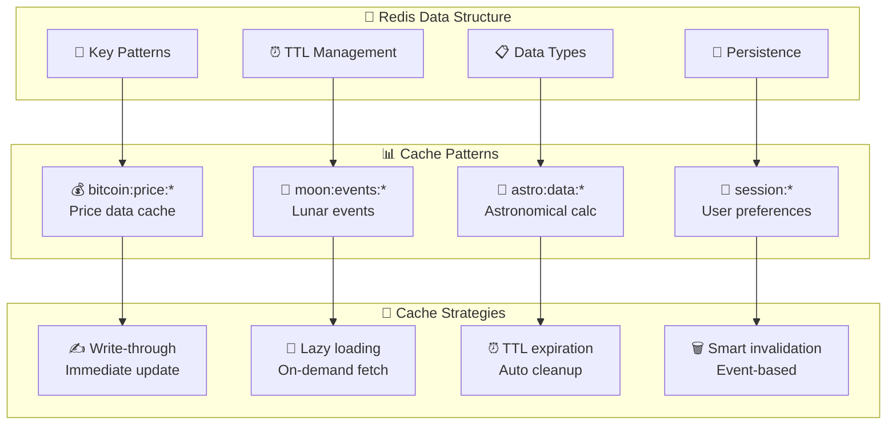

### 📡 **External API Integration**

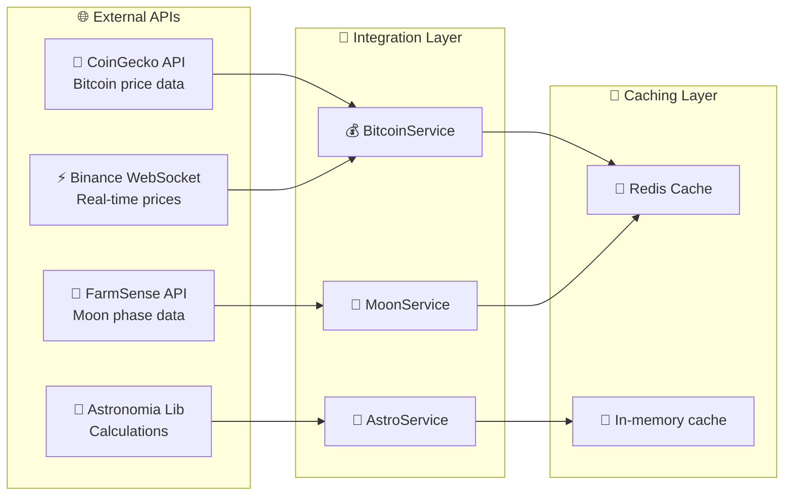

---

## 🔄 Communication patterns

### 📡 **HTTP REST API**

**RESTful endpoints** с consistent response format:

```
GET  /api/bitcoin/price          # Current Bitcoin price
GET  /api/bitcoin/history/:period # Historical price data
GET  /api/moon/phases            # Moon phases data  
GET  /api/moon/events/:date      # Moon events for date
GET  /api/astro/events           # Astronomical events
POST /api/astro/correlations     # Calculate correlations
```

**Response format**:
```typescript
interface APIResponse<T> {
  success: boolean;
  data?: T;
  error?: {
    code: string;
    message: string;
    details?: any;
  };
  meta?: {
    timestamp: string;
    cache?: boolean;
    ttl?: number;
  };
}
```

### ⚡ **WebSocket Real-time**

**WebSocket connections** для real-time updates:

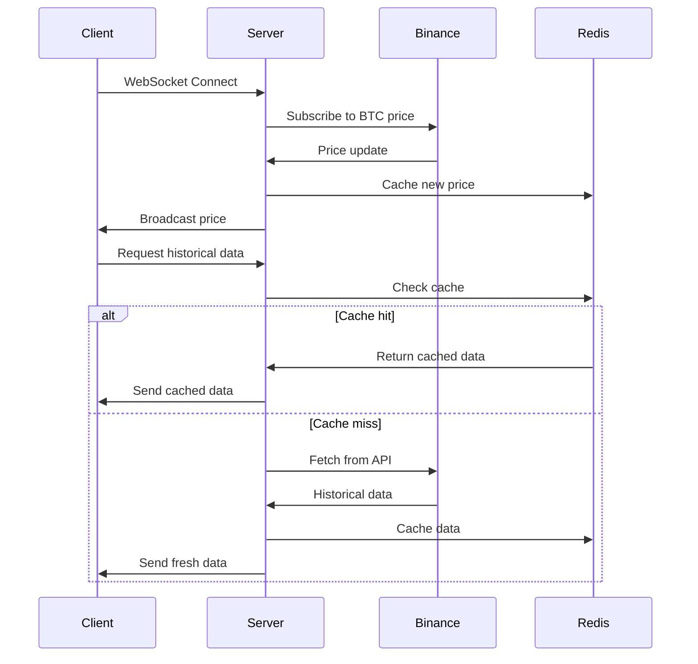

---

## 🧩 Component design

### 📊 **Chart Component Pattern**

**Compound component pattern** для complex chart interactions:

```typescript
// Main chart container component
<ChartContainer>
  <ChartHeader>
    <TimeframeSelector />
    <ThemeToggle />
  </ChartHeader>
  
  <ChartBody>
    <CurrencyChart data={bitcoinData} />
    <LunarEvents events={moonEvents} />
    <AstroEvents events={astroEvents} />
  </ChartBody>
  
  <ChartControls>
    <ZoomControls />
    <ExportControls />
  </ChartControls>
</ChartContainer>
```

### 🪝 **Custom Hooks Architecture**

**Composition over inheritance** через custom hooks:

```typescript
// Chart data management
function useChartData(timeframe: string) {
  const { data: bitcoinData } = useBitcoinPrice(timeframe);
  const { data: moonEvents } = useMoonEvents(timeframe);
  const { data: astroEvents } = useAstroEvents(timeframe);
  
  return useMemo(() => ({
    bitcoin: bitcoinData,
    lunar: moonEvents,
    astro: astroEvents,
    combined: combineChartData(bitcoinData, moonEvents, astroEvents)
  }), [bitcoinData, moonEvents, astroEvents]);
}

// Chart interactions
function useChartInteractions() {
  const [selectedTimeframe, setTimeframe] = useState('1D');
  const [zoomLevel, setZoomLevel] = useState(1);
  const [selectedEvents, setSelectedEvents] = useState([]);
  
  return {
    timeframe: { value: selectedTimeframe, set: setTimeframe },
    zoom: { value: zoomLevel, set: setZoomLevel },
    events: { selected: selectedEvents, set: setSelectedEvents }
  };
}
```

---

## 📊 State management

### 🏪 **Context Providers Structure**

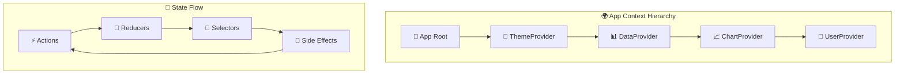

### 💾 **State Persistence Strategy**

```typescript
// Local storage persistence
interface PersistedState {
  theme: 'light' | 'dark';
  preferences: UserPreferences;
  chartSettings: ChartSettings;
  lastVisited: string;
}

// Session storage (temporary)
interface SessionState {
  currentTimeframe: string;
  selectedEvents: string[];
  chartZoom: number;
  scrollPosition: number;
}

// Memory only (volatile)
interface VolatileState {
  loadingStates: Record<string, boolean>;
  errorStates: Record<string, Error | null>;
  realTimeConnected: boolean;
  lastUpdateTime: number;
}
```

---

## 🔒 Security architecture

### 🛡️ **Security Layers**

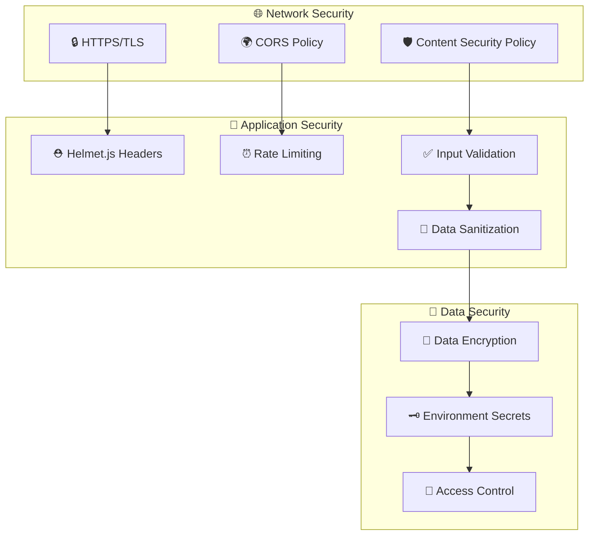

### 🔐 **Security Implementation**

```typescript
// Rate limiting configuration
const rateLimitConfig = {
  windowMs: 15 * 60 * 1000, // 15 minutes
  max: 100, // requests per window
  message: 'Too many requests from this IP',
  standardHeaders: true,
  legacyHeaders: false,
};

// Input validation with express-validator
const validateBitcoinRequest = [
  query('timeframe').isIn(['1h', '4h', '1d', '1w', '1m']),
  query('limit').optional().isInt({ min: 1, max: 1000 }),
  query('from').optional().isISO8601(),
  query('to').optional().isISO8601(),
];

// Security headers with Helmet
app.use(helmet({
  contentSecurityPolicy: {
    directives: {
      defaultSrc: ["'self'"],
      scriptSrc: ["'self'", "'unsafe-inline'", "https://unpkg.com"],
      styleSrc: ["'self'", "'unsafe-inline'"],
      imgSrc: ["'self'", "data:", "https:"],
      connectSrc: ["'self'", "wss:", "https://api.coingecko.com"]
    }
  },
  crossOriginEmbedderPolicy: false
}));
```

---

## ⚡ Performance considerations

### 🚀 **Frontend Performance**

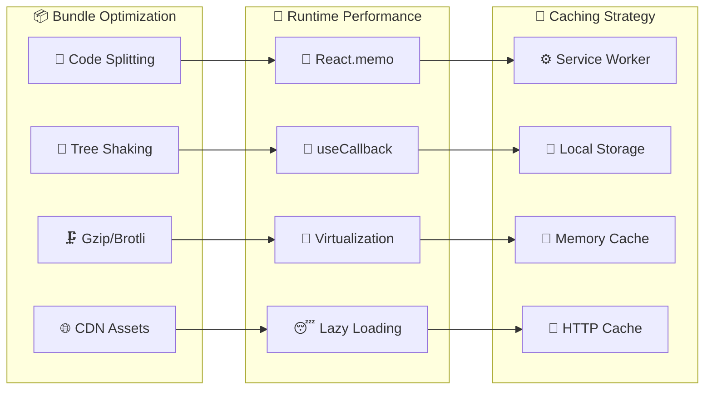

### 🔧 **Backend Performance**

```typescript
// Memory-efficient chart data processing
class ChartMemoryManager {
  private instances = new WeakMap();
  private cleanupTimers = new Map();
  
  register(chartId: string, instance: any) {
    this.instances.set(chartId, instance);
    this.scheduleCleanup(chartId);
  }
  
  private scheduleCleanup(chartId: string) {
    const timer = setTimeout(() => {
      this.cleanup(chartId);
    }, CLEANUP_DELAY);
    
    this.cleanupTimers.set(chartId, timer);
  }
  
  cleanup(chartId: string) {
    const instance = this.instances.get(chartId);
    if (instance?.remove) {
      instance.remove();
    }
    this.instances.delete(chartId);
    this.cleanupTimers.delete(chartId);
  }
}

// Efficient Redis caching with compression
async function cacheData(key: string, data: any, ttl: number = 3600) {
  const compressed = await gzip(JSON.stringify(data));
  await redis.setex(key, ttl, compressed);
}

async function getCachedData(key: string) {
  const compressed = await redis.get(key);
  if (!compressed) return null;
  
  const decompressed = await gunzip(compressed);
  return JSON.parse(decompressed.toString());
}
```

---

## 🧪 Testing architecture

### 🎯 **Testing Pyramid**

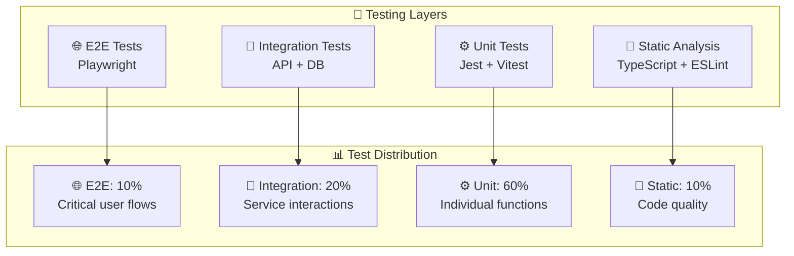

### 🔧 **Test Implementation**

```typescript
// E2E test example
test('Bitcoin chart displays with lunar events', async ({ page }) => {
  await page.goto('/');
  
  // Wait for chart to load
  await page.waitForSelector('[data-testid="bitcoin-chart"]');
  
  // Verify price data is displayed
  const priceElement = page.locator('[data-testid="current-price"]');
  await expect(priceElement).toBeVisible();
  
  // Switch timeframe and verify lunar events
  await page.click('[data-testid="timeframe-1d"]');
  await page.waitForSelector('[data-testid="lunar-event"]');
  
  const lunarEvents = page.locator('[data-testid="lunar-event"]');
  await expect(lunarEvents).toHaveCount.greaterThan(0);
});

// Unit test example  
describe('BitcoinService', () => {
  let service: BitcoinService;
  let mockRedis: jest.Mocked<Redis>;
  
  beforeEach(() => {
    mockRedis = createMockRedis();
    service = new BitcoinService(mockRedis);
  });
  
  it('should cache price data with TTL', async () => {
    const priceData = { price: 50000, timestamp: Date.now() };
    
    await service.cachePrice('BTC', priceData);
    
    expect(mockRedis.setex).toHaveBeenCalledWith(
      'bitcoin:price:BTC',
      3600,
      JSON.stringify(priceData)
    );
  });
});
```

---

## 📚 Дополнительные ресурсы

### 📖 **Связанная документация**
- [🚀 Deployment Guide](DEPLOYMENT.md) - Production deployment инструкции
- [🔧 Development Setup](docs/DEVELOPMENT.md) - Local development guide
- [🧪 Testing Strategy](docs/TESTING.md) - Comprehensive testing approach
- [📊 API Reference](docs/API.md) - Complete API documentation

### 🎯 **Архитектурные решения (ADRs)**
- [ADR-001: Frontend Framework Selection](docs/adr/001-frontend-framework.md)
- [ADR-002: State Management Strategy](docs/adr/002-state-management.md)
- [ADR-003: Caching Architecture](docs/adr/003-caching-strategy.md)
- [ADR-004: Testing Approach](docs/adr/004-testing-strategy.md)

### 🔗 **External References**
- [React Best Practices](https://react.dev/learn)
- [TypeScript Handbook](https://www.typescriptlang.org/docs/)
- [TradingView Lightweight Charts](https://tradingview.github.io/lightweight-charts/)
- [Redis Documentation](https://redis.io/docs/)

---

**🏗️ Эта архитектура обеспечивает scalable, maintainable и performant решение для MoonBit проекта!** 