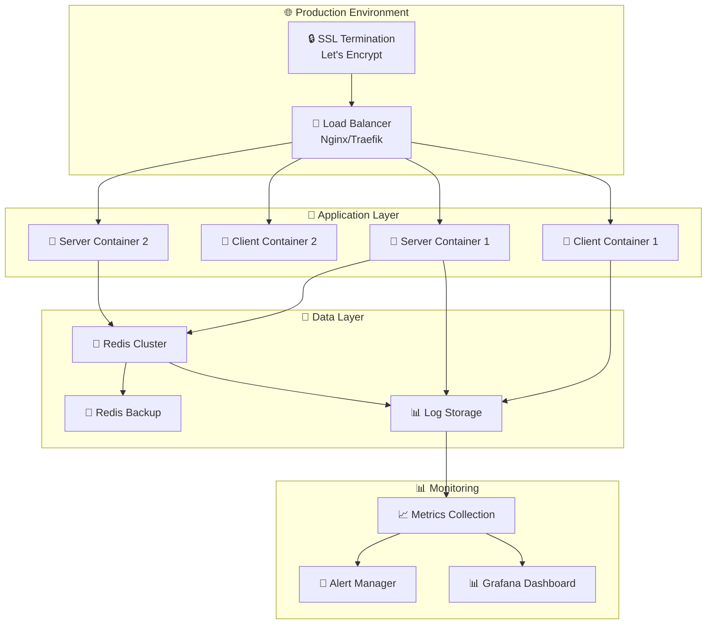

# 🚀 MoonBit - Deployment Guide

> **Production-ready deployment guide** для проекта MoonBit с Docker, environment configuration и best practices

## 📋 Содержание

- [🎯 Обзор deployment](#-обзор-deployment)
- [🐳 Docker deployment](#-docker-deployment)
- [⚙️ Environment configuration](#️-environment-configuration)
- [🔧 Production setup](#-production-setup)
- [📊 Monitoring и logging](#-monitoring-и-logging)
- [🔒 Security considerations](#-security-considerations)
- [⚡ Performance optimization](#-performance-optimization)
- [🧪 Testing deployment](#-testing-deployment)
- [🔄 CI/CD Pipeline](#-cicd-pipeline)
- [🚨 Troubleshooting](#-troubleshooting)

---

## 🎯 Обзор deployment

**MoonBit** поддерживает **multiple deployment strategies** с focus на containerization и cloud-native подходы.

### 🏗️ **Deployment архитектура**



### 🎯 **Supported deployment options**

| Option | Complexity | Scalability | Cost | Best For |
|--------|------------|-------------|------|----------|
| **Docker Compose** | 🟢 Low | 🟡 Medium | 🟢 Low | Development/Small prod |
| **Docker Swarm** | 🟡 Medium | 🟢 High | 🟡 Medium | Mid-scale production |
| **Kubernetes** | 🔴 High | 🟢 Very High | 🔴 High | Large-scale enterprise |
| **Cloud Services** | 🟡 Medium | 🟢 High | 🟡 Medium | Managed infrastructure |

---

## 🐳 Docker deployment

### 📦 **Quick Start (Docker Compose)**

**Простейший способ deployment** для development и small production:

```bash
# 1. Клонируем репозиторий
git clone https://github.com/yourusername/moonbit.git
cd moonbit

# 2. Настраиваем environment
cp .env.example .env
# Редактируем .env файл

# 3. Запускаем через Docker Compose
docker-compose up -d --build

# 4. Проверяем статус
docker-compose ps
docker-compose logs -f
```

### 🔧 **Docker Compose configuration**

```yaml
# docker-compose.prod.yml
version: '3.8'

services:
  client:
    build:
      context: ./bitcoin-moon/client
      dockerfile: Dockerfile
      target: production
    ports:
      - "80:80"
      - "443:443"
    environment:
      - NODE_ENV=production
      - VITE_API_URL=https://api.yourdomain.com
    volumes:
      - ./ssl:/etc/nginx/ssl:ro
    depends_on:
      - server
    restart: unless-stopped
    deploy:
      resources:
        limits:
          cpus: '1.0'
          memory: 512M

  server:
    build:
      context: ./bitcoin-moon/server
      dockerfile: Dockerfile
      target: production
    ports:
      - "3001:3001"
    environment:
      - NODE_ENV=production
      - REDIS_URL=redis://redis:6379
      - PORT=3001
    env_file:
      - .env.production
    depends_on:
      - redis
    restart: unless-stopped
    deploy:
      resources:
        limits:
          cpus: '2.0'
          memory: 1G
    healthcheck:
      test: ["CMD", "curl", "-f", "http://localhost:3001/health"]
      interval: 30s
      timeout: 10s
      retries: 3

  redis:
    image: redis:7-alpine
    ports:
      - "6379:6379"
    volumes:
      - redis_data:/data
      - ./redis.conf:/usr/local/etc/redis/redis.conf
    command: redis-server /usr/local/etc/redis/redis.conf
    restart: unless-stopped
    deploy:
      resources:
        limits:
          cpus: '1.0'
          memory: 512M
    healthcheck:
      test: ["CMD", "redis-cli", "ping"]
      interval: 10s
      timeout: 5s
      retries: 3

volumes:
  redis_data:
    driver: local

networks:
  default:
    driver: bridge
    ipam:
      config:
        - subnet: 172.20.0.0/16
```

### 🏗️ **Multi-stage Dockerfile optimization**

**Client Dockerfile** с production optimization:

```dockerfile
# bitcoin-moon/client/Dockerfile
# Stage 1: Build stage
FROM node:18-alpine AS builder

WORKDIR /app
COPY package*.json ./
RUN npm ci --only=production && npm cache clean --force

COPY . .
RUN npm run build

# Stage 2: Production stage
FROM nginx:alpine AS production

# Install security updates
RUN apk upgrade --no-cache

# Copy built application
COPY --from=builder /app/dist /usr/share/nginx/html

# Copy nginx configuration
COPY nginx.conf /etc/nginx/nginx.conf
COPY ssl.conf /etc/nginx/conf.d/ssl.conf

# Create nginx user and set permissions
RUN addgroup -g 1001 -S nginx && \
    adduser -S -D -H -u 1001 -h /var/cache/nginx -s /sbin/nologin -G nginx -g nginx nginx && \
    chown -R nginx:nginx /usr/share/nginx/html && \
    chown -R nginx:nginx /var/cache/nginx

# Health check
HEALTHCHECK --interval=30s --timeout=10s --start-period=5s --retries=3 \
  CMD curl -f http://localhost/ || exit 1

EXPOSE 80 443

CMD ["nginx", "-g", "daemon off;"]
```

**Server Dockerfile** с security best practices:

```dockerfile
# bitcoin-moon/server/Dockerfile
FROM node:18-alpine AS base

# Install security updates
RUN apk upgrade --no-cache && \
    apk add --no-cache dumb-init curl

# Create app user
RUN addgroup -g 1001 -S nodejs && \
    adduser -S nextjs -u 1001

WORKDIR /app
COPY package*.json ./

# Development stage
FROM base AS development
RUN npm ci
COPY . .
EXPOSE 3001
USER nextjs
CMD ["dumb-init", "npm", "run", "dev"]

# Build stage
FROM base AS builder
RUN npm ci --only=production && npm cache clean --force
COPY . .
RUN npm run build

# Production stage
FROM base AS production
COPY --from=builder --chown=nextjs:nodejs /app/package*.json ./
COPY --from=builder --chown=nextjs:nodejs /app/dist ./dist
COPY --from=builder --chown=nextjs:nodejs /app/node_modules ./node_modules

# Health check
HEALTHCHECK --interval=30s --timeout=10s --start-period=10s --retries=3 \
  CMD curl -f http://localhost:3001/health || exit 1

EXPOSE 3001
USER nextjs

CMD ["dumb-init", "node", "dist/index.js"]
```

---

## ⚙️ Environment configuration

### 🔑 **Environment variables structure**

```bash
# .env.production
NODE_ENV=production

# Server Configuration
PORT=3001
HOST=0.0.0.0

# Database Configuration
REDIS_URL=redis://redis:6379
REDIS_PASSWORD=your_secure_redis_password
REDIS_DB=0

# External API Configuration
COINGECKO_API_KEY=your_coingecko_api_key
BINANCE_WS_URL=wss://stream.binance.com:9443/ws/btcusdt@ticker
FARMSENSE_API_KEY=your_farmsense_api_key

# Security Configuration
JWT_SECRET=your_super_secure_jwt_secret_min_32_chars
CORS_ORIGIN=https://yourdomain.com
RATE_LIMIT_WINDOW=900000
RATE_LIMIT_MAX=100

# Logging Configuration
LOG_LEVEL=info
LOG_FILE=/app/logs/moonbit.log
LOG_MAX_SIZE=10m
LOG_MAX_FILES=5

# Monitoring Configuration
METRICS_ENABLED=true
HEALTH_CHECK_ENABLED=true

# Feature Flags
REAL_TIME_ENABLED=true
ASTRO_EVENTS_ENABLED=true
CACHE_ENABLED=true
```

**Client environment variables**:

```bash
# .env.production (client)
VITE_NODE_ENV=production
VITE_API_URL=https://api.yourdomain.com
VITE_WS_URL=wss://api.yourdomain.com
VITE_APP_VERSION=1.0.0
VITE_SENTRY_DSN=your_sentry_dsn
VITE_ENABLE_ANALYTICS=true
```

### 🔧 **Environment validation**

```typescript
// server/src/config/environment.ts
import { z } from 'zod';

const envSchema = z.object({
  NODE_ENV: z.enum(['development', 'production', 'test']),
  PORT: z.string().transform(Number).pipe(z.number().min(1).max(65535)),
  REDIS_URL: z.string().url(),
  REDIS_PASSWORD: z.string().min(8).optional(),
  COINGECKO_API_KEY: z.string().min(10),
  JWT_SECRET: z.string().min(32),
  CORS_ORIGIN: z.string().url(),
  LOG_LEVEL: z.enum(['error', 'warn', 'info', 'debug']),
});

export const env = envSchema.parse(process.env);

// Validation на старте приложения
if (!env) {
  console.error('❌ Invalid environment configuration');
  process.exit(1);
}
```

---

## 🔧 Production setup

### 🌐 **Nginx configuration**

```nginx
# nginx.conf
user nginx;
worker_processes auto;
error_log /var/log/nginx/error.log warn;
pid /var/run/nginx.pid;

events {
    worker_connections 1024;
    use epoll;
    multi_accept on;
}

http {
    include /etc/nginx/mime.types;
    default_type application/octet-stream;

    # Logging
    log_format main '$remote_addr - $remote_user [$time_local] "$request" '
                    '$status $body_bytes_sent "$http_referer" '
                    '"$http_user_agent" "$http_x_forwarded_for"';
    access_log /var/log/nginx/access.log main;

    # Performance
    sendfile on;
    tcp_nopush on;
    tcp_nodelay on;
    keepalive_timeout 65;
    types_hash_max_size 2048;

    # Gzip compression
    gzip on;
    gzip_vary on;
    gzip_min_length 1024;
    gzip_proxied any;
    gzip_comp_level 6;
    gzip_types
        text/plain
        text/css
        text/xml
        text/javascript
        application/json
        application/javascript
        application/xml+rss
        application/atom+xml
        image/svg+xml;

    # Security headers
    add_header X-Frame-Options DENY;
    add_header X-Content-Type-Options nosniff;
    add_header X-XSS-Protection "1; mode=block";
    add_header Strict-Transport-Security "max-age=31536000; includeSubDomains" always;

    # Rate limiting
    limit_req_zone $binary_remote_addr zone=api:10m rate=10r/s;

    # Upstream servers
    upstream api_backend {
        least_conn;
        server server1:3001 max_fails=3 fail_timeout=30s;
        server server2:3001 max_fails=3 fail_timeout=30s;
    }

    # Main server block
    server {
        listen 80;
        listen [::]:80;
        server_name yourdomain.com www.yourdomain.com;

        # Redirect HTTP to HTTPS
        return 301 https://$server_name$request_uri;
    }

    server {
        listen 443 ssl http2;
        listen [::]:443 ssl http2;
        server_name yourdomain.com www.yourdomain.com;

        # SSL Configuration
        ssl_certificate /etc/nginx/ssl/fullchain.pem;
        ssl_certificate_key /etc/nginx/ssl/privkey.pem;
        ssl_protocols TLSv1.2 TLSv1.3;
        ssl_ciphers ECDHE-RSA-AES256-GCM-SHA512:DHE-RSA-AES256-GCM-SHA512:ECDHE-RSA-AES256-GCM-SHA384:DHE-RSA-AES256-GCM-SHA384;
        ssl_prefer_server_ciphers off;
        ssl_session_cache shared:SSL:10m;
        ssl_session_timeout 10m;

        # Static files
        root /usr/share/nginx/html;
        index index.html;

        # Client-side routing
        location / {
            try_files $uri $uri/ /index.html;
            
            # Cache static assets
            location ~* \.(js|css|png|jpg|jpeg|gif|ico|svg|woff|woff2|ttf|eot)$ {
                expires 1y;
                add_header Cache-Control "public, immutable";
            }
        }

        # API proxy
        location /api/ {
            limit_req zone=api burst=20 nodelay;
            
            proxy_pass http://api_backend;
            proxy_http_version 1.1;
            proxy_set_header Upgrade $http_upgrade;
            proxy_set_header Connection 'upgrade';
            proxy_set_header Host $host;
            proxy_set_header X-Real-IP $remote_addr;
            proxy_set_header X-Forwarded-For $proxy_add_x_forwarded_for;
            proxy_set_header X-Forwarded-Proto $scheme;
            proxy_cache_bypass $http_upgrade;
            
            # Timeout settings
            proxy_connect_timeout 60s;
            proxy_send_timeout 60s;
            proxy_read_timeout 60s;
        }

        # WebSocket proxy
        location /ws {
            proxy_pass http://api_backend;
            proxy_http_version 1.1;
            proxy_set_header Upgrade $http_upgrade;
            proxy_set_header Connection "upgrade";
            proxy_set_header Host $host;
            proxy_set_header X-Real-IP $remote_addr;
            proxy_set_header X-Forwarded-For $proxy_add_x_forwarded_for;
            proxy_set_header X-Forwarded-Proto $scheme;
        }

        # Health check
        location /health {
            access_log off;
            return 200 "healthy\n";
            add_header Content-Type text/plain;
        }
    }
}
```

### 🔴 **Redis production configuration**

```conf
# redis.conf
# Network
bind 127.0.0.1
port 6379
tcp-backlog 511
timeout 0
tcp-keepalive 300

# General
daemonize no
supervised no
pidfile /var/run/redis_6379.pid
loglevel notice
logfile ""

# Snapshotting
save 900 1
save 300 10
save 60 10000
stop-writes-on-bgsave-error yes
rdbcompression yes
rdbchecksum yes
dbfilename dump.rdb
dir /data

# Security
requirepass your_secure_redis_password
rename-command FLUSHDB ""
rename-command FLUSHALL ""
rename-command KEYS ""
rename-command CONFIG ""

# Memory management
maxmemory 256mb
maxmemory-policy allkeys-lru
maxmemory-samples 5

# Append only file
appendonly yes
appendfilename "appendonly.aof"
appendfsync everysec
no-appendfsync-on-rewrite no
auto-aof-rewrite-percentage 100
auto-aof-rewrite-min-size 64mb

# Slow log
slowlog-log-slower-than 10000
slowlog-max-len 128

# Client output buffer limits
client-output-buffer-limit normal 0 0 0
client-output-buffer-limit replica 256mb 64mb 60
client-output-buffer-limit pubsub 32mb 8mb 60
```

---

## 📊 Monitoring и logging

### 📈 **Metrics collection**

```typescript
// server/src/utils/metrics.ts
import client from 'prom-client';

// Default metrics
const register = new client.Registry();
client.collectDefaultMetrics({ register });

// Custom metrics
export const httpRequestDuration = new client.Histogram({
  name: 'http_request_duration_seconds',
  help: 'Duration of HTTP requests in seconds',
  labelNames: ['method', 'route', 'status'],
  buckets: [0.1, 0.5, 1, 2, 5],
  registers: [register],
});

export const redisOperations = new client.Counter({
  name: 'redis_operations_total',
  help: 'Total number of Redis operations',
  labelNames: ['operation', 'status'],
  registers: [register],
});

export const bitcoinPriceGauge = new client.Gauge({
  name: 'bitcoin_price_usd',
  help: 'Current Bitcoin price in USD',
  registers: [register],
});

// Metrics endpoint
app.get('/metrics', async (req, res) => {
  res.set('Content-Type', register.contentType);
  res.end(await register.metrics());
});
```

### 📊 **Grafana dashboard configuration**

```json
{
  "dashboard": {
    "title": "MoonBit Monitoring",
    "panels": [
      {
        "title": "HTTP Requests Rate",
        "type": "graph",
        "targets": [
          {
            "expr": "rate(http_request_duration_seconds_count[5m])",
            "legendFormat": "{{method}} {{route}}"
          }
        ]
      },
      {
        "title": "Response Times",
        "type": "graph",
        "targets": [
          {
            "expr": "histogram_quantile(0.95, rate(http_request_duration_seconds_bucket[5m]))",
            "legendFormat": "95th percentile"
          }
        ]
      },
      {
        "title": "Bitcoin Price",
        "type": "singlestat",
        "targets": [
          {
            "expr": "bitcoin_price_usd",
            "legendFormat": "BTC/USD"
          }
        ]
      },
      {
        "title": "Redis Operations",
        "type": "graph",
        "targets": [
          {
            "expr": "rate(redis_operations_total[5m])",
            "legendFormat": "{{operation}}"
          }
        ]
      }
    ]
  }
}
```

### 📋 **Structured logging**

```typescript
// server/src/utils/logger.ts
import winston from 'winston';

const logger = winston.createLogger({
  level: process.env.LOG_LEVEL || 'info',
  format: winston.format.combine(
    winston.format.timestamp(),
    winston.format.errors({ stack: true }),
    winston.format.json()
  ),
  defaultMeta: { service: 'moonbit-api' },
  transports: [
    new winston.transports.File({ 
      filename: 'logs/error.log', 
      level: 'error',
      maxsize: 10485760, // 10MB
      maxFiles: 5,
    }),
    new winston.transports.File({ 
      filename: 'logs/combined.log',
      maxsize: 10485760, // 10MB
      maxFiles: 5,
    }),
  ],
});

if (process.env.NODE_ENV !== 'production') {
  logger.add(new winston.transports.Console({
    format: winston.format.simple()
  }));
}

export default logger;
```

---

## 🔒 Security considerations

### 🛡️ **Security checklist**

```markdown
## 🔒 Production Security Checklist

### Container Security
- [ ] ✅ Use non-root user in containers
- [ ] ✅ Multi-stage builds to minimize attack surface
- [ ] ✅ Regular base image updates
- [ ] ✅ Security scanning with Trivy/Snyk
- [ ] ✅ Resource limits configured

### Network Security
- [ ] ✅ HTTPS/TLS encryption (Let's Encrypt)
- [ ] ✅ Proper CORS configuration
- [ ] ✅ Rate limiting implemented
- [ ] ✅ DDoS protection (Cloudflare/AWS Shield)
- [ ] ✅ Private network for inter-service communication

### Application Security
- [ ] ✅ Input validation and sanitization
- [ ] ✅ SQL injection protection (prepared statements)
- [ ] ✅ XSS protection headers
- [ ] ✅ CSRF protection
- [ ] ✅ Secure session management

### Infrastructure Security
- [ ] ✅ Regular security updates
- [ ] ✅ Firewall configuration
- [ ] ✅ SSH key-based authentication
- [ ] ✅ VPN access for sensitive operations
- [ ] ✅ Backup encryption

### Monitoring & Incident Response
- [ ] ✅ Security monitoring and alerting
- [ ] ✅ Log aggregation and analysis
- [ ] ✅ Incident response plan
- [ ] ✅ Security audit trail
- [ ] ✅ Vulnerability scanning
```

### 🔐 **SSL/TLS setup с Let's Encrypt**

```bash
#!/bin/bash
# ssl-setup.sh

# Install Certbot
curl -L https://dl.eff.org/certbot-auto -o /usr/local/bin/certbot-auto
chmod +x /usr/local/bin/certbot-auto

# Generate SSL certificate
certbot-auto certonly \
  --webroot \
  --webroot-path=/var/www/html \
  --email your-email@domain.com \
  --agree-tos \
  --no-eff-email \
  --force-renewal \
  -d yourdomain.com \
  -d www.yourdomain.com

# Setup auto-renewal
echo "0 12 * * * /usr/local/bin/certbot-auto renew --quiet" | crontab -

# Copy certificates to Docker volume
cp /etc/letsencrypt/live/yourdomain.com/fullchain.pem /ssl/
cp /etc/letsencrypt/live/yourdomain.com/privkey.pem /ssl/
```

---

## ⚡ Performance optimization

### 🚀 **Application performance**

```typescript
// server/src/middleware/performance.ts
import compression from 'compression';
import helmet from 'helmet';
import { rateLimit } from 'express-rate-limit';

// Compression middleware
app.use(compression({
  filter: (req, res) => {
    if (req.headers['x-no-compression']) {
      return false;
    }
    return compression.filter(req, res);
  },
  level: 6,
  threshold: 1024,
}));

// Rate limiting
const limiter = rateLimit({
  windowMs: 15 * 60 * 1000, // 15 minutes
  max: 100, // requests per window
  message: 'Too many requests from this IP',
  standardHeaders: true,
  legacyHeaders: false,
});

app.use('/api/', limiter);

// API response caching
const NodeCache = require('node-cache');
const cache = new NodeCache({ stdTTL: 600 }); // 10 minutes

app.use('/api/bitcoin/price', (req, res, next) => {
  const key = req.originalUrl;
  const cached = cache.get(key);
  
  if (cached) {
    res.json(cached);
  } else {
    res.sendResponse = res.json;
    res.json = (body) => {
      cache.set(key, body);
      res.sendResponse(body);
    };
    next();
  }
});
```

### 📊 **Database optimization**

```typescript
// server/src/repositories/BaseRepository.ts
export class BaseRepository {
  protected redis: Redis;
  
  constructor(redis: Redis) {
    this.redis = redis;
  }
  
  // Batch operations for better performance
  async batchSet(data: Record<string, any>, ttl: number = 3600): Promise<void> {
    const pipeline = this.redis.pipeline();
    
    Object.entries(data).forEach(([key, value]) => {
      pipeline.setex(key, ttl, JSON.stringify(value));
    });
    
    await pipeline.exec();
  }
  
  // Connection pooling and clustering
  async withConnection<T>(operation: (redis: Redis) => Promise<T>): Promise<T> {
    try {
      return await operation(this.redis);
    } catch (error) {
      // Retry logic with exponential backoff
      await this.sleep(Math.pow(2, retryCount) * 1000);
      throw error;
    }
  }
  
  private sleep(ms: number): Promise<void> {
    return new Promise(resolve => setTimeout(resolve, ms));
  }
}
```

---

## 🧪 Testing deployment

### 🎯 **Deployment testing strategy**

```bash
#!/bin/bash
# test-deployment.sh

echo "🧪 Testing MoonBit deployment..."

# Health checks
echo "📊 Checking service health..."
curl -f http://localhost:3001/health || exit 1
curl -f http://localhost/health || exit 1

# API endpoint tests
echo "🔌 Testing API endpoints..."
curl -f http://localhost/api/bitcoin/price || exit 1
curl -f http://localhost/api/moon/phases || exit 1

# WebSocket connection test
echo "⚡ Testing WebSocket connection..."
wscat -c ws://localhost/ws --timeout 5 || exit 1

# Performance tests
echo "⚡ Running performance tests..."
ab -n 1000 -c 10 http://localhost/api/bitcoin/price

# Load testing
echo "📈 Load testing..."
artillery run loadtest.yml

echo "✅ Deployment tests completed successfully!"
```

**Load testing configuration**:

```yaml
# loadtest.yml
config:
  target: 'http://localhost'
  phases:
    - duration: 60
      arrivalRate: 10
      name: "Warm up"
    - duration: 120
      arrivalRate: 50
      name: "Load test"
    - duration: 60
      arrivalRate: 100
      name: "Stress test"

scenarios:
  - name: "Bitcoin price API"
    weight: 70
    flow:
      - get:
          url: "/api/bitcoin/price"
      - think: 1

  - name: "Moon phases API"
    weight: 30
    flow:
      - get:
          url: "/api/moon/phases"
      - think: 2
```

---

## 🔄 CI/CD Pipeline

### 🚀 **GitHub Actions workflow**

```yaml
# .github/workflows/deploy.yml
name: Deploy to Production

on:
  push:
    branches: [main]
  release:
    types: [published]

jobs:
  test:
    runs-on: ubuntu-latest
    steps:
      - uses: actions/checkout@v3
      
      - name: Setup Node.js
        uses: actions/setup-node@v3
        with:
          node-version: '18'
          cache: 'npm'
          
      - name: Install dependencies
        run: npm ci
        
      - name: Run tests
        run: npm run test:ci
        
      - name: Run E2E tests
        run: npm run test:e2e

  security:
    runs-on: ubuntu-latest
    steps:
      - uses: actions/checkout@v3
      
      - name: Run security audit
        run: npm audit --audit-level high
        
      - name: Run Snyk security scan
        uses: snyk/actions/node@master
        env:
          SNYK_TOKEN: ${{ secrets.SNYK_TOKEN }}

  build:
    needs: [test, security]
    runs-on: ubuntu-latest
    steps:
      - uses: actions/checkout@v3
      
      - name: Set up Docker Buildx
        uses: docker/setup-buildx-action@v2
        
      - name: Login to Docker Hub
        uses: docker/login-action@v2
        with:
          username: ${{ secrets.DOCKER_USERNAME }}
          password: ${{ secrets.DOCKER_PASSWORD }}
          
      - name: Build and push client
        uses: docker/build-push-action@v4
        with:
          context: ./bitcoin-moon/client
          push: true
          tags: moonbit/client:${{ github.sha }},moonbit/client:latest
          
      - name: Build and push server
        uses: docker/build-push-action@v4
        with:
          context: ./bitcoin-moon/server
          push: true
          tags: moonbit/server:${{ github.sha }},moonbit/server:latest

  deploy:
    needs: [build]
    runs-on: ubuntu-latest
    environment: production
    steps:
      - name: Deploy to production
        uses: appleboy/ssh-action@v0.1.5
        with:
          host: ${{ secrets.PROD_HOST }}
          username: ${{ secrets.PROD_USER }}
          key: ${{ secrets.PROD_SSH_KEY }}
          script: |
            cd /opt/moonbit
            docker-compose pull
            docker-compose up -d --remove-orphans
            docker system prune -f
            
      - name: Run deployment tests
        run: |
          sleep 30
          curl -f https://yourdomain.com/health
          
      - name: Notify Slack
        uses: 8398a7/action-slack@v3
        with:
          status: ${{ job.status }}
          channel: '#deployments'
        env:
          SLACK_WEBHOOK_URL: ${{ secrets.SLACK_WEBHOOK }}
```

---

## 🚨 Troubleshooting

### 🔧 **Common deployment issues**

| Problem | Symptoms | Solution |
|---------|----------|----------|
| **Container won't start** | Exit code 1, immediate restart | Check environment variables, logs, resource limits |
| **Database connection failed** | Redis connection errors | Verify Redis container, network, credentials |
| **High memory usage** | OOM kills, slow performance | Tune memory limits, check for memory leaks |
| **SSL certificate issues** | HTTPS not working | Verify certificate files, renewal process |
| **Rate limiting triggered** | 429 errors | Adjust rate limit configuration |

### 📊 **Monitoring commands**

```bash
# Container status and logs
docker-compose ps
docker-compose logs -f --tail=100

# System resources
docker stats
df -h
free -h

# Network connectivity
curl -I http://localhost/health
nc -zv localhost 3001
nc -zv localhost 6379

# Redis monitoring
redis-cli info memory
redis-cli info stats
redis-cli monitor

# Application logs
tail -f /var/log/nginx/access.log
tail -f /app/logs/moonbit.log

# Performance monitoring
top -p $(pgrep node)
iotop
nethogs
```

### 🔄 **Rollback procedure**

```bash
#!/bin/bash
# rollback.sh

echo "🔄 Starting rollback procedure..."

# Get previous version
PREVIOUS_VERSION=$(docker image ls moonbit/server --format "table {{.Tag}}" | sed -n '2p')

echo "Rolling back to version: $PREVIOUS_VERSION"

# Update docker-compose to use previous version
sed -i "s/moonbit\/server:latest/moonbit\/server:$PREVIOUS_VERSION/g" docker-compose.yml
sed -i "s/moonbit\/client:latest/moonbit\/client:$PREVIOUS_VERSION/g" docker-compose.yml

# Deploy previous version
docker-compose up -d --force-recreate

# Verify rollback
sleep 30
curl -f http://localhost/health || echo "❌ Rollback failed"

echo "✅ Rollback completed"
```

---

## 📚 Дополнительные ресурсы

### 🔗 **Полезные ссылки**
- [Docker Compose Production Guide](https://docs.docker.com/compose/production/)
- [Nginx Performance Tuning](https://nginx.org/en/docs/http/ngx_http_core_module.html)
- [Redis Production Deployment](https://redis.io/topics/admin)
- [Let's Encrypt Documentation](https://letsencrypt.org/docs/)

### 📊 **Monitoring tools**
- **Grafana** - Metrics visualization
- **Prometheus** - Metrics collection
- **Loki** - Log aggregation
- **AlertManager** - Alert management

### 🔧 **Deployment tools**
- **Docker Swarm** - Container orchestration
- **Kubernetes** - Advanced container orchestration
- **Terraform** - Infrastructure as Code
- **Ansible** - Configuration management

---

**🚀 MoonBit ready for production deployment! May your deployments be smooth and your uptime be high! 🌙** 