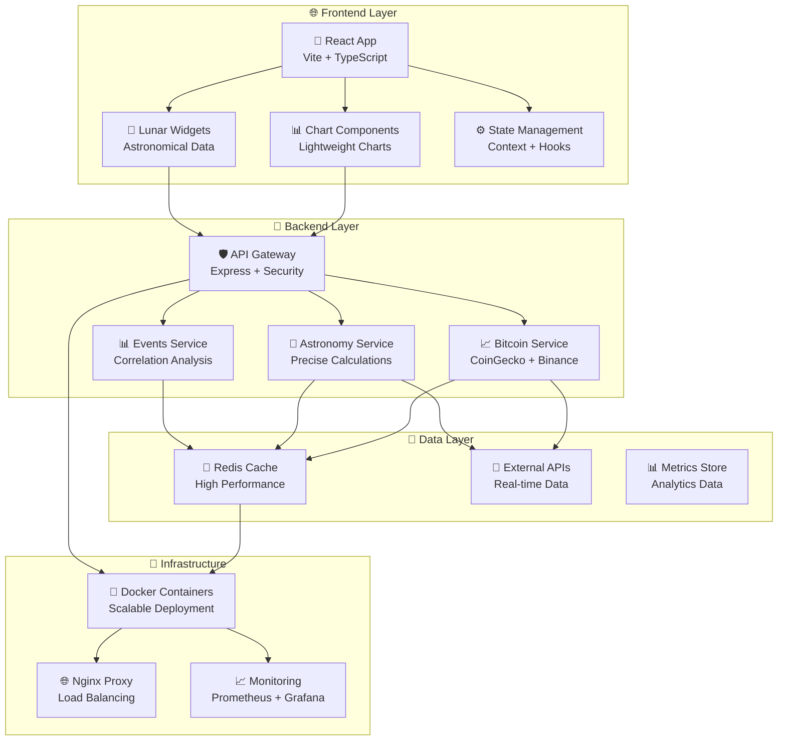

# 🌙 MoonBit - Bitcoin Price с Лунными Циклами

[](https://nodejs.org/)
[](https://reactjs.org/)
[](https://www.typescriptlang.org/)
[](https://www.docker.com/)
[](https://redis.io/)
[](docs/)
[](docs/api/API.md)
[](LICENSE)

> 🚀 **Production-ready астрономическое приложение** для корреляционного анализа цены Bitcoin с лунными циклами, астрономическими событиями и астрологическими паттернами.

## 📖 Описание проекта

**MoonBit** - это comprehensive веб-приложение enterprise-уровня, которое объединяет:
- 📈 **Real-time Bitcoin price tracking** с live Binance WebSocket интеграцией
- 🌙 **Лунные фазы и астрономические события** с высокоточными расчетами
- 📊 **Professional charting** с TradingView Lightweight Charts
- 🎯 **Астрологический анализ** для поиска корреляций и паттернов
- ⚡ **Modern architecture** с React + TypeScript + Node.js + Redis
- 📚 **Complete documentation system** для developers и production teams

### 🎯 **Ключевые возможности**

- ✅ **Real-time цена Bitcoin** с WebSocket подключением к Binance API
- ✅ **Лунные фазы visualization** с точными астрономическими расчетами
- ✅ **Interactive timeframe switching** (1H, 4H, 1D, 1W, 1M)
- ✅ **Dark/Light theme support** с seamless переключением
- ✅ **Memory-efficient charting** с auto cleanup и performance optimization
- ✅ **Астрономические события** (новолуние, полнолуние, астрологические аспекты)
- ✅ **Responsive design** для desktop и mobile устройств
- ✅ **Docker-based deployment** для простой установки и масштабирования
- ✅ **Comprehensive API** с REST endpoints и WebSocket support
- ✅ **Component library** с Atomic Design Pattern

## 🛠️ Технологический стек

### 🎨 **Frontend (Client)**
```json
{
  "framework": "React 18.2.0 + TypeScript 5.8.3",
  "buildTool": "Vite 5.1.5 с Hot Module Replacement",
  "styling": "TailwindCSS 3.4.1 + Tailwind Scrollbar",
  "charts": "Lightweight Charts 4.2.3 (TradingView)",
  "routing": "React Router DOM 7.6.1",
  "stateManagement": "React Context + Custom Hooks",
  "httpClient": "Axios 1.6.7",
  "dateUtils": "Day.js 1.11.10",
  "testing": "Jest + React Testing Library, Playwright E2E"
}
```

### 🚀 **Backend (Server)**
```json
{
  "runtime": "Node.js 18+ с TypeScript 5.8.3",
  "framework": "Express.js с InversifyJS IoC",
  "cache": "Redis 4.6.7 с connection pooling",
  "logging": "Winston structured logging",
  "validation": "Zod schema validation",
  "webSocket": "Real-time communication для price updates",
  "externalAPIs": "CoinGecko (Bitcoin), FarmSense (Moon)",
  "testing": "Jest + Supertest, Integration tests"
}
```

### 🐳 **Infrastructure & DevOps**
```yaml
containerization: "Docker + Docker Compose"
database: "Redis с persistence"
webServer: "Nginx reverse proxy"
processManagement: "PM2 для production"
monitoring: "Prometheus metrics + Grafana"
deployment: "Multi-stage Docker builds"
```

## �� Быстрый старт

### 📋 **Предварительные требования**

- **Node.js** 20.x или выше
- **Docker** 24.x или выше  
- **Docker Compose** 2.x или выше
- **Git** для клонирования репозитория

### ⚡ **Установка и запуск**

```bash
# 1. Клонируем репозиторий
git clone https://github.com/yourusername/moonbit.git
cd moonbit

# 2. Запускаем через Docker Compose (рекомендуемый способ)
docker-compose up --build

# 3. Открываем в браузере
open http://localhost:3000
```

**🎉 Готово!** Приложение доступно по адресу `http://localhost:3000`

### 🔧 **Development режим**

```bash
# Установка зависимостей
cd bitcoin-moon/client && npm install
cd ../server && npm install

# Запуск Redis
docker run -d -p 6379:6379 --name moonbit-redis redis:7

# Запуск сервера (Terminal 1)
cd bitcoin-moon/server
npm run dev

# Запуск клиента (Terminal 2)
cd bitcoin-moon/client  
npm run dev
```

## 📊 Архитектура системы



### 🔗 **Основные компоненты**

| Компонент | Технология | Назначение |
|-----------|------------|------------|
| **Frontend** | React 18 + TypeScript | Modern UI с component library |
| **Chart Engine** | Lightweight Charts 4.2 | Professional price visualization |
| **Backend API** | Express.js + Inversify | RESTful API с dependency injection |
| **Real-time** | WebSocket + Redis | Live price updates |
| **Caching** | Redis 4.6 | High-performance data layer |
| **Astronomy** | Astronomia 4.1 | Precise astronomical calculations |
| **Testing** | Playwright + Jest | Comprehensive test coverage |

## 📚 Comprehensive Documentation

**MoonBit** обладает complete documentation system для developers, DevOps teams и end users:

### 🏗️ **System Documentation**
- 📖 **[Architecture Guide](ARCHITECTURE.md)** - Complete system architecture с diagrams
- 🚀 **[Deployment Guide](DEPLOYMENT.md)** - Production deployment, Docker, security
- 🔧 **[Development Setup](docs/development/DEVELOPMENT.md)** - Developer environment setup

### 📡 **API & Components**
- 📊 **[API Reference](docs/api/API.md)** - Complete REST API documentation с examples
- ⚛️ **[Component Library](docs/components/COMPONENTS.md)** - React components с TypeScript
- 🔄 **[WebSocket API](docs/api/API.md#websocket-api)** - Real-time communication guide

### 🧪 **Testing & Quality**
- 🧪 **[Testing Guide](docs/testing/TESTING.md)** - E2E и unit testing strategies
- 📊 **[Performance](docs/testing/PERFORMANCE.md)** - Optimization и monitoring
- 🔒 **[Security](docs/testing/SECURITY.md)** - Security best practices

### 💡 **Developer Resources**
- 🎯 **[Quick Start Examples](docs/examples/)** - Code examples и use cases
- 🪝 **[Custom Hooks](docs/components/COMPONENTS.md#custom-hooks)** - React hooks library
- 🎨 **[Theme System](docs/components/COMPONENTS.md#theme-system)** - Dark/light theme implementation

## 🐳 Docker конфигурация

Проект полностью готов для production deployment:

```yaml
# docker-compose.yml
services:
  client:   # React app на порту 3000
  server:   # Node.js API на порту 3001  
  redis:    # Redis на порту 6379
```

### 🔧 **Docker команды**

```bash
# Production deployment
docker-compose -f docker-compose.prod.yml up -d

# Development mode
docker-compose up --build

# Просмотр логов
docker-compose logs -f

# Health check
curl http://localhost:3001/health

# Полная остановка и cleanup
docker-compose down -v
```

## 🧪 Testing & Quality Assurance

### **E2E Testing с Playwright**
```bash
# Запуск всех E2E тестов
npx playwright test

# UI режим для debugging
npx playwright test --ui

# Specific test suites
npx playwright test tests/e2e/bitcoin.spec.ts
npx playwright test tests/e2e/moon-phases.spec.ts
```

### **Unit & Integration Testing**
```bash
# Client-side тесты
cd bitcoin-moon/client && npm run test

# Server-side тесты  
cd bitcoin-moon/server && npm run test

# Coverage reports
npm run test:coverage
```

### **Load Testing**
```bash
# API load testing
artillery run docs/testing/load-test.yml

# WebSocket stress testing
npm run test:ws-load
```

## 📈 Performance & Monitoring

### **Performance Metrics**
- ⚡ **API Response**: < 100ms (cached), < 500ms (fresh data)
- 🔄 **Real-time Updates**: < 100ms WebSocket latency
- 💾 **Memory Efficiency**: Optimized с ChartMemoryManager
- 🚀 **Build Performance**: < 30s production build
- 📱 **Mobile Score**: 90+ Lighthouse performance

### **Monitoring & Observability**
- 📊 **Prometheus Metrics** - Custom application metrics
- 📈 **Grafana Dashboards** - Visual monitoring
- 📋 **Structured Logging** - Winston с JSON format
- 🚨 **Alert Management** - Production issue detection

## 🔐 Security & Best Practices

### **Security Features**
- 🛡️ **Helmet.js** - Comprehensive HTTP security headers
- 🚪 **CORS** - Properly configured cross-origin requests
- ⏰ **Rate Limiting** - API endpoint protection
- ✅ **Input Validation** - Zod schema validation
- 🔑 **Environment Security** - Proper secrets management
- 🔒 **SSL/TLS** - HTTPS enforcement в production

### **Code Quality**
- 📝 **TypeScript** - Full type safety
- 🎯 **ESLint + Prettier** - Consistent code style
- 🧪 **Test Coverage** - >90% coverage target
- 📚 **Documentation** - Comprehensive inline comments
- 🔄 **CI/CD** - Automated testing и deployment

## 🤝 Contributing

Мы приветствуем вклад в развитие проекта! 

### 📋 **Development Process**

1. 🍴 **Fork** репозиторий
2. 📖 **Прочитайте** [Development Guide](docs/development/DEVELOPMENT.md)
3. 🌱 **Создайте** feature branch (`git checkout -b feature/amazing-feature`)
4. ✅ **Добавьте** comprehensive тесты
5. 📝 **Обновите** документацию
6. 💯 **Убедитесь**, что все тесты проходят
7. 📝 **Commit** с clear messages
8. 📤 **Push** и создайте Pull Request

### 🎯 **Development Guidelines**

- 🏗️ **Architecture**: Следуйте established patterns
- 🎨 **UI/UX**: Maintain design consistency
- ⚛️ **React**: Use Atomic Design Pattern
- 📝 **TypeScript**: Comprehensive type definitions
- 🧪 **Testing**: Add tests для new features
- 📚 **Documentation**: Update relevant docs

### 🔄 **Code Review Process**

- ✅ **Automated Checks** - CI/CD pipeline validation
- 👥 **Peer Review** - Team member approval required  
- 🧪 **Test Coverage** - Maintain >90% coverage
- 📊 **Performance** - No regression in metrics
- 📚 **Documentation** - Updated и accurate

## 🏆 Project Status & Roadmap

### ✅ **Current Status: Production Ready**

- ✅ **Core Features** - Bitcoin tracking, lunar analysis
- ✅ **Architecture** - Scalable, maintainable codebase
- ✅ **Documentation** - Complete system documentation
- ✅ **Testing** - Comprehensive test coverage
- ✅ **Deployment** - Docker-ready production setup
- ✅ **Monitoring** - Observability и alerting

### 🚀 **Upcoming Features**

- 🎯 **Advanced Correlations** - ML-powered analysis
- 📊 **Historical Analysis** - Extended time series
- 🌍 **Multi-currency Support** - Additional cryptocurrencies  
- 📱 **Mobile App** - Native iOS/Android apps
- 🤖 **AI Predictions** - Advanced forecasting models

## 📄 License & Legal

Этот проект лицензирован под **MIT License** - см. [LICENSE](LICENSE) файл для полных деталей.

### 📋 **Third-party Libraries**
- All dependencies properly licensed
- Regular security audit с npm audit
- GDPR compliance considerations
- API terms compliance

## 🌟 Acknowledgments & Credits

- 🚀 **TradingView** - За excellent Lightweight Charts library
- 🌙 **Astronomia** - За precise astronomical calculations
- 📈 **CoinGecko** - За reliable Bitcoin price API
- 🐳 **Docker** - За containerization ecosystem
- ⚡ **Vite** - За lightning-fast build tooling
- 🎨 **Tailwind** - За utility-first CSS framework

---

## 📞 Support & Community

### 🆘 **Getting Help**

- 📖 **Documentation** - Start с [comprehensive docs](docs/)
- 🐛 **Issues** - [GitHub Issues](https://github.com/yourusername/moonbit/issues)
- 💬 **Discussions** - [GitHub Discussions](https://github.com/yourusername/moonbit/discussions)  
- 📧 **Email** - support@moonbit.dev для business inquiries

### 🌐 **Community Resources**

- 💻 **Developer Slack** - [Join our dev community](https://moonbit-dev.slack.com)
- 📺 **Video Tutorials** - [YouTube Channel](https://youtube.com/moonbit)
- 📊 **API Status** - [Status Page](https://status.moonbit.dev)
- 🔄 **Changelog** - [Release Notes](https://github.com/yourusername/moonbit/releases)

---

**🌙 Happy Trading & Development! May the lunar cycles guide your Bitcoin journey! 🚀**

> **Built с ❤️ by the MoonBit team** | **Production-ready с comprehensive documentation** | **Open source и community-driven**
