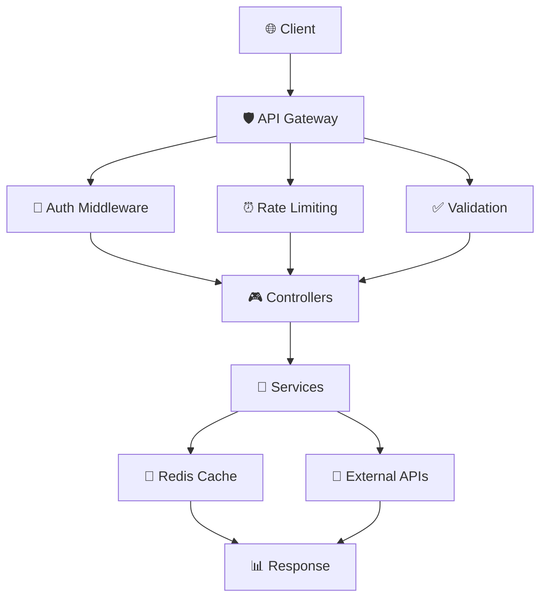

# 📡 MoonBit API Reference

> **Complete REST API documentation** для проекта MoonBit с examples, authentication и best practices

## 📋 Содержание

- [🎯 API Overview](#-api-overview)
- [🔐 Authentication](#-authentication)
- [📊 Bitcoin Endpoints](#-bitcoin-endpoints)
- [🌙 Moon Endpoints](#-moon-endpoints)
- [🌟 Astro Endpoints](#-astro-endpoints)
- [⚡ Events Endpoints](#-events-endpoints)
- [🔄 WebSocket API](#-websocket-api)
- [📋 Response Format](#-response-format)
- [🚨 Error Handling](#-error-handling)
- [⏰ Rate Limiting](#-rate-limiting)
- [🧪 Testing](#-testing)

---

## 🎯 API Overview

**MoonBit API** предоставляет **RESTful endpoints** для получения данных о Bitcoin, астрономических событиях и корреляционного анализа.

### 🌐 **Base URL**
```
Development:  http://localhost:3001/api
Production:   https://api.moonbit.app/api
```

### 🏗️ **API Architecture**


### 📊 **API Versioning**
```
Current Version: v1
Path: /api/v1/*
Support: Backward compatible
```

---

## 🔐 Authentication

### 🔑 **API Key Authentication**

Для production использования требуется API key:

```bash
# Header-based authentication
curl -H "X-API-Key: your_api_key_here" \
     https://api.moonbit.app/api/v1/bitcoin/price
```

```typescript
// JavaScript/TypeScript example
const headers = {
  'X-API-Key': 'your_api_key_here',
  'Content-Type': 'application/json'
};

const response = await fetch('/api/v1/bitcoin/price', { headers });
```

### 🔒 **Rate Limiting**
```yaml
Rate Limits:
  - Free tier: 100 requests/15min
  - Authenticated: 1000 requests/15min
  - Premium: 10000 requests/15min
```

---

## 📊 Bitcoin Endpoints

### 💰 **Get Current Bitcoin Price**

```http
GET /api/v1/bitcoin/price
```

**Response:**
```json
{
  "success": true,
  "data": {
    "price": 50000.25,
    "currency": "USD",
    "timestamp": "2024-12-24T16:00:00.000Z",
    "change_24h": 2.5,
    "change_24h_percent": 0.05,
    "volume_24h": 1234567890,
    "market_cap": 980000000000
  },
  "meta": {
    "source": "coingecko",
    "cache": true,
    "ttl": 60
  }
}
```

**Example:**
```bash
curl "http://localhost:3001/api/v1/bitcoin/price"
```

```typescript
// TypeScript example
interface BitcoinPrice {
  price: number;
  currency: string;
  timestamp: string;
  change_24h: number;
  change_24h_percent: number;
  volume_24h: number;
  market_cap: number;
}

const getBitcoinPrice = async (): Promise<BitcoinPrice> => {
  const response = await fetch('/api/v1/bitcoin/price');
  const result = await response.json();
  return result.data;
};
```

### 📈 **Get Bitcoin Price History**

```http
GET /api/v1/bitcoin/history
```

**Query Parameters:**
| Parameter | Type | Required | Default | Description |
|-----------|------|----------|---------|-------------|
| `timeframe` | string | No | `1d` | Time interval: `1h`, `4h`, `1d`, `1w`, `1m` |
| `limit` | number | No | `100` | Number of data points (max: 1000) |
| `from` | string | No | | Start date (ISO 8601) |
| `to` | string | No | | End date (ISO 8601) |

**Response:**
```json
{
  "success": true,
  "data": {
    "timeframe": "1d",
    "prices": [
      {
        "timestamp": "2024-12-24T00:00:00.000Z",
        "open": 49500.00,
        "high": 50200.00,
        "low": 49300.00,
        "close": 50000.25,
        "volume": 123456789
      }
    ],
    "total": 30,
    "period": {
      "from": "2024-11-24T00:00:00.000Z",
      "to": "2024-12-24T00:00:00.000Z"
    }
  }
}
```

**Examples:**
```bash
# Last 7 days with daily candles
curl "http://localhost:3001/api/v1/bitcoin/history?timeframe=1d&limit=7"

# Specific date range
curl "http://localhost:3001/api/v1/bitcoin/history?from=2024-12-01&to=2024-12-24"

# Hourly data for last 24 hours
curl "http://localhost:3001/api/v1/bitcoin/history?timeframe=1h&limit=24"
```

---

## 🌙 Moon Endpoints

### 🌕 **Get Moon Phases**

```http
GET /api/v1/moon/phases
```

**Query Parameters:**
| Parameter | Type | Required | Default | Description |
|-----------|------|----------|---------|-------------|
| `from` | string | No | today | Start date (ISO 8601) |
| `to` | string | No | +30 days | End date (ISO 8601) |
| `timezone` | string | No | `UTC` | Timezone (IANA format) |

**Response:**
```json
{
  "success": true,
  "data": {
    "phases": [
      {
        "phase": "new_moon",
        "timestamp": "2024-12-24T12:30:00.000Z",
        "illumination": 0.02,
        "distance_km": 384400,
        "angular_diameter": 31.5,
        "next_phase": {
          "phase": "first_quarter",
          "timestamp": "2024-12-31T18:15:00.000Z"
        }
      }
    ],
    "current": {
      "phase": "waning_crescent",
      "illumination": 0.15,
      "age_days": 26.3
    }
  }
}
```

**Example:**
```typescript
interface MoonPhase {
  phase: 'new_moon' | 'waxing_crescent' | 'first_quarter' | 'waxing_gibbous' 
        | 'full_moon' | 'waning_gibbous' | 'third_quarter' | 'waning_crescent';
  timestamp: string;
  illumination: number;
  distance_km: number;
  angular_diameter: number;
}

const getMoonPhases = async (from?: string, to?: string): Promise<MoonPhase[]> => {
  const params = new URLSearchParams();
  if (from) params.append('from', from);
  if (to) params.append('to', to);
  
  const response = await fetch(`/api/v1/moon/phases?${params}`);
  const result = await response.json();
  return result.data.phases;
};
```

### 🌙 **Get Moon Events for Date**

```http
GET /api/v1/moon/events/:date
```

**Path Parameters:**
| Parameter | Type | Required | Description |
|-----------|------|----------|-------------|
| `date` | string | Yes | Date in YYYY-MM-DD format |

**Response:**
```json
{
  "success": true,
  "data": {
    "date": "2024-12-24",
    "events": [
      {
        "type": "moon_rise",
        "timestamp": "2024-12-24T06:30:00.000Z",
        "azimuth": 85.5,
        "altitude": 0
      },
      {
        "type": "moon_set",
        "timestamp": "2024-12-24T18:45:00.000Z",
        "azimuth": 275.2,
        "altitude": 0
      },
      {
        "type": "moon_transit",
        "timestamp": "2024-12-24T12:37:00.000Z",
        "azimuth": 180,
        "altitude": 45.8
      }
    ],
    "summary": {
      "phase": "waning_crescent",
      "illumination": 0.15,
      "visible_hours": 12.25
    }
  }
}
```

---

## 🌟 Astro Endpoints

### 🌌 **Get Astronomical Events**

```http
GET /api/v1/astro/events
```

**Query Parameters:**
| Parameter | Type | Required | Default | Description |
|-----------|------|----------|---------|-------------|
| `from` | string | No | today | Start date (ISO 8601) |
| `to` | string | No | +30 days | End date (ISO 8601) |
| `types` | string | No | all | Event types (comma-separated) |
| `significance` | string | No | all | Event significance: `low`, `medium`, `high` |

**Event Types:**
- `conjunction` - Planetary conjunctions
- `opposition` - Planetary oppositions
- `eclipse` - Solar/Lunar eclipses
- `equinox` - Seasonal equinoxes
- `solstice` - Seasonal solstices
- `meteor_shower` - Meteor showers
- `planet_retrograde` - Retrograde motions

**Response:**
```json
{
  "success": true,
  "data": {
    "events": [
      {
        "id": "conjunction_mars_jupiter_20241224",
        "type": "conjunction",
        "name": "Mars-Jupiter Conjunction",
        "timestamp": "2024-12-24T14:30:00.000Z",
        "significance": "high",
        "description": "Mars and Jupiter appear very close in the sky",
        "participants": ["mars", "jupiter"],
        "angular_separation": 0.5,
        "visibility": {
          "naked_eye": true,
          "best_time": "evening",
          "duration_hours": 3
        },
        "astrological": {
          "aspects": ["conjunction"],
          "houses": ["10th"],
          "interpretation": "Strong energy for expansion and action"
        }
      }
    ],
    "summary": {
      "total": 15,
      "by_significance": {
        "high": 3,
        "medium": 7,
        "low": 5
      }
    }
  }
}
```

### 🔮 **Calculate Correlations**

```http
POST /api/v1/astro/correlations
```

**Request Body:**
```json
{
  "price_data": {
    "timeframe": "1d",
    "from": "2024-11-01",
    "to": "2024-12-24"
  },
  "astro_events": [
    "moon_phases",
    "planetary_aspects",
    "eclipses"
  ],
  "analysis_type": "pearson",
  "options": {
    "lag_days": 7,
    "confidence_level": 0.95
  }
}
```

**Response:**
```json
{
  "success": true,
  "data": {
    "correlations": [
      {
        "event_type": "new_moon",
        "correlation": -0.23,
        "p_value": 0.045,
        "significance": "medium",
        "sample_size": 12,
        "confidence_interval": [-0.45, -0.01],
        "interpretation": "Weak negative correlation with price movements"
      }
    ],
    "analysis": {
      "period": "2024-11-01 to 2024-12-24",
      "method": "pearson",
      "total_events": 45,
      "significant_correlations": 3
    }
  }
}
```

---

## ⚡ Events Endpoints

### 📊 **Get Upcoming Events**

```http
GET /api/v1/events/upcoming
```

**Query Parameters:**
| Parameter | Type | Required | Default | Description |
|-----------|------|----------|---------|-------------|
| `days` | number | No | `7` | Number of days ahead (max: 90) |
| `types` | string | No | all | Event types filter |
| `min_significance` | string | No | `low` | Minimum significance level |

**Response:**
```json
{
  "success": true,
  "data": {
    "events": [
      {
        "date": "2024-12-25",
        "moon_events": [
          {
            "type": "first_quarter",
            "timestamp": "2024-12-25T15:30:00.000Z",
            "significance": "medium"
          }
        ],
        "astro_events": [
          {
            "type": "meteor_shower",
            "name": "Geminids Peak",
            "timestamp": "2024-12-25T02:00:00.000Z",
            "significance": "high"
          }
        ],
        "bitcoin_predictions": {
          "price_target": 52000,
          "confidence": 0.68,
          "factors": ["new_moon_effect", "year_end_rally"]
        }
      }
    ],
    "summary": {
      "total_days": 7,
      "total_events": 23,
      "high_significance": 5
    }
  }
}
```

---

## 🔄 WebSocket API

### ⚡ **Real-time Bitcoin Price Updates**

**Connection:**
```javascript
const ws = new WebSocket('ws://localhost:3001/ws/bitcoin/price');

ws.onopen = () => {
  console.log('Connected to Bitcoin price stream');
};

ws.onmessage = (event) => {
  const data = JSON.parse(event.data);
  console.log('Price update:', data);
};

ws.onerror = (error) => {
  console.error('WebSocket error:', error);
};
```

**Message Format:**
```json
{
  "type": "price_update",
  "data": {
    "price": 50125.75,
    "change": 125.50,
    "change_percent": 0.25,
    "timestamp": "2024-12-24T16:05:30.000Z",
    "volume_24h": 1234567890
  }
}
```

### 🌙 **Lunar Event Notifications**

```javascript
const ws = new WebSocket('ws://localhost:3001/ws/lunar/events');

// Subscribe to specific event types
ws.send(JSON.stringify({
  action: 'subscribe',
  events: ['new_moon', 'full_moon', 'eclipses']
}));
```

**Event Message:**
```json
{
  "type": "lunar_event",
  "data": {
    "event_type": "new_moon",
    "timestamp": "2024-12-24T12:30:00.000Z",
    "phase": "new_moon",
    "illumination": 0.02,
    "significance": "high",
    "price_correlation": {
      "historical": -0.23,
      "prediction": "bearish"
    }
  }
}
```

---

## 📋 Response Format

### ✅ **Success Response**

```typescript
interface APIResponse<T> {
  success: true;
  data: T;
  meta?: {
    timestamp: string;
    source?: string;
    cache?: boolean;
    ttl?: number;
    pagination?: {
      page: number;
      limit: number;
      total: number;
      has_next: boolean;
    };
  };
}
```

### ❌ **Error Response**

```typescript
interface APIError {
  success: false;
  error: {
    code: string;
    message: string;
    details?: any;
    timestamp: string;
    request_id: string;
  };
}
```

**Error Codes:**
| Code | HTTP Status | Description |
|------|-------------|-------------|
| `INVALID_REQUEST` | 400 | Invalid request parameters |
| `UNAUTHORIZED` | 401 | Missing or invalid API key |
| `FORBIDDEN` | 403 | Access denied |
| `NOT_FOUND` | 404 | Endpoint or resource not found |
| `RATE_LIMITED` | 429 | Rate limit exceeded |
| `INTERNAL_ERROR` | 500 | Internal server error |
| `SERVICE_UNAVAILABLE` | 503 | External service unavailable |

---

## 🚨 Error Handling

### 📝 **Error Response Examples**

```json
// Validation Error (400)
{
  "success": false,
  "error": {
    "code": "INVALID_REQUEST",
    "message": "Invalid timeframe parameter",
    "details": {
      "field": "timeframe",
      "value": "invalid",
      "allowed": ["1h", "4h", "1d", "1w", "1m"]
    },
    "timestamp": "2024-12-24T16:00:00.000Z",
    "request_id": "req_123456789"
  }
}

// Rate Limit Error (429)
{
  "success": false,
  "error": {
    "code": "RATE_LIMITED",
    "message": "Rate limit exceeded",
    "details": {
      "limit": 100,
      "window": "15min",
      "reset_at": "2024-12-24T16:15:00.000Z"
    },
    "timestamp": "2024-12-24T16:00:00.000Z",
    "request_id": "req_123456789"
  }
}
```

### 🔄 **Retry Strategy**

```typescript
class APIClient {
  async request<T>(endpoint: string, options?: RequestInit): Promise<T> {
    let lastError;
    
    for (let attempt = 1; attempt <= 3; attempt++) {
      try {
        const response = await fetch(endpoint, {
          ...options,
          headers: {
            'X-API-Key': this.apiKey,
            'Content-Type': 'application/json',
            ...options?.headers
          }
        });
        
        if (response.status === 429) {
          // Rate limited - wait and retry
          const retryAfter = response.headers.get('Retry-After');
          await this.sleep(parseInt(retryAfter || '60') * 1000);
          continue;
        }
        
        if (!response.ok) {
          throw new APIError(await response.json());
        }
        
        return await response.json();
        
      } catch (error) {
        lastError = error;
        if (attempt < 3) {
          await this.sleep(Math.pow(2, attempt) * 1000); // Exponential backoff
        }
      }
    }
    
    throw lastError;
  }
  
  private sleep(ms: number): Promise<void> {
    return new Promise(resolve => setTimeout(resolve, ms));
  }
}
```

---

## ⏰ Rate Limiting

### 📊 **Rate Limit Headers**

All API responses include rate limit information:

```http
HTTP/1.1 200 OK
X-RateLimit-Limit: 100
X-RateLimit-Remaining: 95
X-RateLimit-Reset: 1703433600
X-RateLimit-Window: 900
Retry-After: 60
```

### 🎯 **Rate Limit Tiers**

| Tier | Requests/15min | Concurrent WS | Price |
|------|----------------|---------------|-------|
| **Free** | 100 | 2 | Free |
| **Basic** | 1,000 | 10 | $9/month |
| **Pro** | 10,000 | 50 | $29/month |
| **Enterprise** | Unlimited | Unlimited | Custom |

---

## 🧪 Testing

### 🔧 **API Testing with cURL**

```bash
#!/bin/bash
# test-api.sh

echo "🧪 Testing MoonBit API..."

# Health check
echo "📊 Health check..."
curl -f "http://localhost:3001/health" || exit 1

# Bitcoin price
echo "💰 Testing Bitcoin price endpoint..."
curl -s "http://localhost:3001/api/v1/bitcoin/price" | jq .

# Moon phases
echo "🌙 Testing Moon phases endpoint..."
curl -s "http://localhost:3001/api/v1/moon/phases" | jq .

# Historical data
echo "📈 Testing historical data..."
curl -s "http://localhost:3001/api/v1/bitcoin/history?timeframe=1d&limit=7" | jq .

echo "✅ API tests completed!"
```

### 📊 **Postman Collection**

```json
{
  "info": {
    "name": "MoonBit API",
    "schema": "https://schema.getpostman.com/json/collection/v2.1.0/collection.json"
  },
  "variable": [
    {
      "key": "baseUrl",
      "value": "http://localhost:3001/api/v1"
    },
    {
      "key": "apiKey",
      "value": "your_api_key_here"
    }
  ],
  "item": [
    {
      "name": "Bitcoin Price",
      "request": {
        "method": "GET",
        "url": "{{baseUrl}}/bitcoin/price",
        "header": [
          {
            "key": "X-API-Key",
            "value": "{{apiKey}}"
          }
        ]
      }
    }
  ]
}
```

### 🎯 **TypeScript SDK Example**

```typescript
// moonbit-sdk.ts
export class MoonBitAPI {
  private baseUrl: string;
  private apiKey?: string;
  
  constructor(config: { baseUrl: string; apiKey?: string }) {
    this.baseUrl = config.baseUrl;
    this.apiKey = config.apiKey;
  }
  
  async getBitcoinPrice(): Promise<BitcoinPrice> {
    return this.request<BitcoinPrice>('/bitcoin/price');
  }
  
  async getBitcoinHistory(options: HistoryOptions): Promise<PriceHistory> {
    const params = new URLSearchParams(options as any);
    return this.request<PriceHistory>(`/bitcoin/history?${params}`);
  }
  
  async getMoonPhases(from?: string, to?: string): Promise<MoonPhase[]> {
    const params = new URLSearchParams();
    if (from) params.append('from', from);
    if (to) params.append('to', to);
    
    const response = await this.request<{ phases: MoonPhase[] }>(`/moon/phases?${params}`);
    return response.phases;
  }
  
  private async request<T>(endpoint: string): Promise<T> {
    const response = await fetch(`${this.baseUrl}${endpoint}`, {
      headers: {
        ...(this.apiKey && { 'X-API-Key': this.apiKey }),
        'Content-Type': 'application/json'
      }
    });
    
    if (!response.ok) {
      throw new Error(`API request failed: ${response.statusText}`);
    }
    
    const result = await response.json();
    return result.data;
  }
}

// Usage
const api = new MoonBitAPI({
  baseUrl: 'http://localhost:3001/api/v1',
  apiKey: 'your_api_key_here'
});

const price = await api.getBitcoinPrice();
const phases = await api.getMoonPhases();
```

---

## 📚 Дополнительные ресурсы

### 🔗 **Related Documentation**
- [🏗️ Architecture Guide](../ARCHITECTURE.md) - System architecture overview
- [🚀 Deployment Guide](../DEPLOYMENT.md) - Production deployment
- [🧪 Testing Guide](../testing/TESTING.md) - Testing strategies

### 🛠️ **Tools & Libraries**
- **Postman** - API testing and documentation
- **Insomnia** - REST client alternative
- **OpenAPI/Swagger** - API specification
- **WebSocket Test Tools** - wscat, Postman WebSocket

### 📊 **Monitoring & Analytics**
- **Rate limiting dashboard** - `/api/v1/admin/rate-limits`
- **API metrics** - `/api/v1/admin/metrics`
- **Health status** - `/health`

---

**📡 MoonBit API готов к использованию! May your API calls be fast and your correlations be significant! 🌙** 