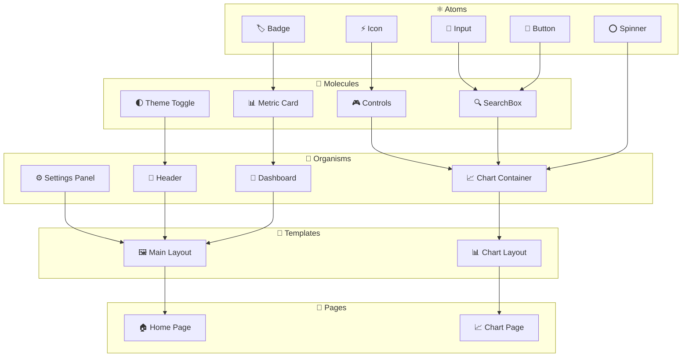

# 🧩 MoonBit Component Library

> **Complete React component documentation** с examples, props, hooks и design patterns

## 📋 Содержание

- [🎯 Component Architecture](#-component-architecture)
- [⚛️ Atomic Components](#️-atomic-components)
- [🧬 Organism Components](#-organism-components)
- [📊 Chart Components](#-chart-components)
- [🪝 Custom Hooks](#-custom-hooks)
- [🎨 Theme System](#-theme-system)
- [📱 Responsive Design](#-responsive-design)
- [♿ Accessibility](#-accessibility)
- [🧪 Testing Components](#-testing-components)
- [📚 Usage Examples](#-usage-examples)

---

## 🎯 Component Architecture

**MoonBit** использует **Atomic Design Pattern** для организации компонентов с четкой иерархией и reusability.

### 🏗️ **Component Hierarchy**



### 📁 **File Structure**

```
src/components/
├── atoms/                 # Basic building blocks
│   ├── Button/
│   │   ├── Button.tsx
│   │   ├── Button.test.tsx
│   │   └── index.ts
│   ├── Input/
│   ├── Badge/
│   └── index.ts
├── molecules/             # Simple combinations
│   ├── SearchBox/
│   ├── MetricCard/
│   └── index.ts
├── organisms/             # Complex components
│   ├── charts/
│   │   ├── BaseChart.tsx
│   │   ├── CurrencyChart.tsx
│   │   └── ChartContainer.tsx
│   ├── Dashboard.jsx
│   └── Header.jsx
└── pages/                 # Page-level components
    ├── HomePage.tsx
    └── ChartPage.tsx
```

---

## ⚛️ Atomic Components

### 🔘 **Button Component**

**Base button component** с multiple variants и полной accessibility поддержкой.

```typescript
// components/atoms/Button/Button.tsx
interface ButtonProps {
  variant?: 'primary' | 'secondary' | 'outline' | 'ghost' | 'danger';
  size?: 'sm' | 'md' | 'lg' | 'xl';
  disabled?: boolean;
  loading?: boolean;
  icon?: ReactNode;
  iconPosition?: 'left' | 'right';
  fullWidth?: boolean;
  children: ReactNode;
  onClick?: (event: MouseEvent<HTMLButtonElement>) => void;
  type?: 'button' | 'submit' | 'reset';
  className?: string;
}

const Button: FC<ButtonProps> = ({
  variant = 'primary',
  size = 'md',
  disabled = false,
  loading = false,
  icon,
  iconPosition = 'left',
  fullWidth = false,
  children,
  onClick,
  type = 'button',
  className,
  ...props
}) => {
  const baseClasses = [
    'inline-flex items-center justify-center font-medium transition-colors',
    'focus:outline-none focus:ring-2 focus:ring-offset-2',
    'disabled:pointer-events-none disabled:opacity-50',
  ];

  const variantClasses = {
    primary: 'bg-blue-600 text-white hover:bg-blue-700 focus:ring-blue-500',
    secondary: 'bg-gray-600 text-white hover:bg-gray-700 focus:ring-gray-500',
    outline: 'border border-gray-300 bg-transparent hover:bg-gray-50 focus:ring-blue-500',
    ghost: 'text-gray-700 hover:bg-gray-100 focus:ring-gray-500',
    danger: 'bg-red-600 text-white hover:bg-red-700 focus:ring-red-500',
  };

  const sizeClasses = {
    sm: 'px-3 py-1.5 text-sm rounded-md',
    md: 'px-4 py-2 text-sm rounded-md',
    lg: 'px-6 py-3 text-base rounded-md',
    xl: 'px-8 py-4 text-lg rounded-lg',
  };

  return (
    <button
      type={type}
      disabled={disabled || loading}
      onClick={onClick}
      className={cn(
        baseClasses,
        variantClasses[variant],
        sizeClasses[size],
        fullWidth && 'w-full',
        className
      )}
      {...props}
    >
      {loading && <Spinner size="sm" className="mr-2" />}
      {!loading && icon && iconPosition === 'left' && (
        <span className="mr-2">{icon}</span>
      )}
      {children}
      {!loading && icon && iconPosition === 'right' && (
        <span className="ml-2">{icon}</span>
      )}
    </button>
  );
};
```

**Usage Examples:**
```tsx
// Basic usage
<Button onClick={() => console.log('clicked')}>
  Click me
</Button>

// With variants and sizes
<Button variant="primary" size="lg">Primary Large</Button>
<Button variant="outline" size="sm">Outline Small</Button>

// With icons
<Button icon={<ChartIcon />} iconPosition="left">
  View Chart
</Button>

// Loading state
<Button loading disabled>
  Processing...
</Button>

// Full width
<Button fullWidth variant="primary">
  Full Width Button
</Button>
```

### 📝 **Input Component**

**Flexible input component** с validation, icons и comprehensive accessibility.

```typescript
// components/atoms/Input/Input.tsx
interface InputProps {
  type?: 'text' | 'email' | 'password' | 'number' | 'search' | 'url';
  placeholder?: string;
  value?: string;
  defaultValue?: string;
  disabled?: boolean;
  required?: boolean;
  error?: string;
  helpText?: string;
  label?: string;
  icon?: ReactNode;
  iconPosition?: 'left' | 'right';
  size?: 'sm' | 'md' | 'lg';
  fullWidth?: boolean;
  onChange?: (event: ChangeEvent<HTMLInputElement>) => void;
  onFocus?: (event: FocusEvent<HTMLInputElement>) => void;
  onBlur?: (event: FocusEvent<HTMLInputElement>) => void;
  className?: string;
}

const Input: FC<InputProps> = ({
  type = 'text',
  placeholder,
  value,
  defaultValue,
  disabled = false,
  required = false,
  error,
  helpText,
  label,
  icon,
  iconPosition = 'left',
  size = 'md',
  fullWidth = false,
  onChange,
  onFocus,
  onBlur,
  className,
  ...props
}) => {
  const id = useId();
  const errorId = `${id}-error`;
  const helpId = `${id}-help`;

  const baseClasses = [
    'border border-gray-300 rounded-md shadow-sm transition-colors',
    'focus:outline-none focus:ring-2 focus:ring-blue-500 focus:border-blue-500',
    'disabled:bg-gray-50 disabled:text-gray-500 disabled:cursor-not-allowed',
  ];

  const sizeClasses = {
    sm: 'px-3 py-1.5 text-sm',
    md: 'px-3 py-2 text-sm',
    lg: 'px-4 py-3 text-base',
  };

  const errorClasses = error 
    ? 'border-red-300 focus:border-red-500 focus:ring-red-500'
    : '';

  return (
    <div className={cn('relative', fullWidth && 'w-full', className)}>
      {label && (
        <label htmlFor={id} className="block text-sm font-medium text-gray-700 mb-1">
          {label}
          {required && <span className="text-red-500 ml-1">*</span>}
        </label>
      )}
      
      <div className="relative">
        {icon && iconPosition === 'left' && (
          <div className="absolute left-3 top-1/2 transform -translate-y-1/2 text-gray-400">
            {icon}
          </div>
        )}
        
        <input
          id={id}
          type={type}
          placeholder={placeholder}
          value={value}
          defaultValue={defaultValue}
          disabled={disabled}
          required={required}
          onChange={onChange}
          onFocus={onFocus}
          onBlur={onBlur}
          aria-invalid={error ? 'true' : 'false'}
          aria-describedby={cn(
            error && errorId,
            helpText && helpId
          )}
          className={cn(
            baseClasses,
            sizeClasses[size],
            errorClasses,
            icon && iconPosition === 'left' && 'pl-10',
            icon && iconPosition === 'right' && 'pr-10',
            fullWidth && 'w-full'
          )}
          {...props}
        />
        
        {icon && iconPosition === 'right' && (
          <div className="absolute right-3 top-1/2 transform -translate-y-1/2 text-gray-400">
            {icon}
          </div>
        )}
      </div>
      
      {error && (
        <p id={errorId} className="mt-1 text-sm text-red-600">
          {error}
        </p>
      )}
      
      {helpText && !error && (
        <p id={helpId} className="mt-1 text-sm text-gray-500">
          {helpText}
        </p>
      )}
    </div>
  );
};
```

### 🏷️ **Badge Component**

```typescript
// components/atoms/Badge/Badge.tsx
interface BadgeProps {
  variant?: 'default' | 'success' | 'warning' | 'error' | 'info';
  size?: 'sm' | 'md' | 'lg';
  children: ReactNode;
  className?: string;
}

const Badge: FC<BadgeProps> = ({
  variant = 'default',
  size = 'md',
  children,
  className
}) => {
  const baseClasses = [
    'inline-flex items-center font-medium rounded-full',
  ];

  const variantClasses = {
    default: 'bg-gray-100 text-gray-800',
    success: 'bg-green-100 text-green-800',
    warning: 'bg-yellow-100 text-yellow-800',
    error: 'bg-red-100 text-red-800',
    info: 'bg-blue-100 text-blue-800',
  };

  const sizeClasses = {
    sm: 'px-2 py-0.5 text-xs',
    md: 'px-2.5 py-1 text-sm',
    lg: 'px-3 py-1.5 text-base',
  };

  return (
    <span className={cn(
      baseClasses,
      variantClasses[variant],
      sizeClasses[size],
      className
    )}>
      {children}
    </span>
  );
};
```

---

## 🧬 Organism Components

### 📊 **Chart Container**

**Complex chart wrapper** с state management, error handling и performance optimization.

```typescript
// components/organisms/charts/ChartContainer.tsx
interface ChartContainerProps {
  title?: string;
  subtitle?: string;
  data: ChartData;
  timeframe: string;
  loading?: boolean;
  error?: string;
  onTimeframeChange?: (timeframe: string) => void;
  onRefresh?: () => void;
  className?: string;
  children?: ReactNode;
}

const ChartContainer: FC<ChartContainerProps> = ({
  title,
  subtitle,
  data,
  timeframe,
  loading = false,
  error,
  onTimeframeChange,
  onRefresh,
  className,
  children
}) => {
  const chartRef = useRef<HTMLDivElement>(null);
  const [chartReady, setChartReady] = useState(false);

  return (
    <div className={cn(
      'bg-white dark:bg-gray-800 rounded-lg shadow-sm border border-gray-200 dark:border-gray-700',
      className
    )}>
      {/* Header */}
      <div className="flex items-center justify-between p-4 border-b border-gray-200 dark:border-gray-700">
        <div>
          {title && (
            <h3 className="text-lg font-semibold text-gray-900 dark:text-white">
              {title}
            </h3>
          )}
          {subtitle && (
            <p className="text-sm text-gray-500 dark:text-gray-400">
              {subtitle}
            </p>
          )}
        </div>
        
        <div className="flex items-center space-x-2">
          {/* Timeframe Selector */}
          <TimeframeSelector
            value={timeframe}
            onChange={onTimeframeChange}
            options={['1H', '4H', '1D', '1W', '1M']}
          />
          
          {/* Refresh Button */}
          <Button
            variant="ghost"
            size="sm"
            icon={<RefreshIcon className={loading ? 'animate-spin' : ''} />}
            onClick={onRefresh}
            disabled={loading}
          />
        </div>
      </div>

      {/* Chart Content */}
      <div className="relative p-4">
        {loading && (
          <div className="absolute inset-0 flex items-center justify-center bg-white/50 dark:bg-gray-800/50 z-10">
            <Spinner size="lg" />
          </div>
        )}
        
        {error && (
          <div className="flex items-center justify-center h-64">
            <div className="text-center">
              <AlertTriangleIcon className="mx-auto h-12 w-12 text-red-500 mb-4" />
              <p className="text-red-600 dark:text-red-400">{error}</p>
              <Button
                variant="outline"
                size="sm"
                onClick={onRefresh}
                className="mt-2"
              >
                Try Again
              </Button>
            </div>
          </div>
        )}
        
        {!loading && !error && (
          <div ref={chartRef} className="h-96">
            {children}
          </div>
        )}
      </div>
    </div>
  );
};
```

### 📱 **Dashboard Component**

```typescript
// components/organisms/Dashboard.tsx
interface DashboardProps {
  bitcoinData: BitcoinData;
  moonData: MoonData;
  loading?: boolean;
  error?: string;
}

const Dashboard: FC<DashboardProps> = ({
  bitcoinData,
  moonData,
  loading,
  error
}) => {
  const [timeframe, setTimeframe] = useState('1D');
  const [selectedMetrics, setSelectedMetrics] = useState(['price', 'volume']);

  return (
    <div className="space-y-6">
      {/* Metrics Row */}
      <div className="grid grid-cols-1 md:grid-cols-2 lg:grid-cols-4 gap-4">
        <MetricCard
          title="Bitcoin Price"
          value={`$${bitcoinData.price.toLocaleString()}`}
          change={bitcoinData.change24h}
          changePercent={bitcoinData.changePercent24h}
          icon={<BitcoinIcon />}
        />
        
        <MetricCard
          title="24h Volume"
          value={`$${(bitcoinData.volume24h / 1e9).toFixed(2)}B`}
          icon={<VolumeIcon />}
        />
        
        <MetricCard
          title="Moon Phase"
          value={moonData.currentPhase}
          subtitle={`${(moonData.illumination * 100).toFixed(0)}% illuminated`}
          icon={<MoonIcon />}
        />
        
        <MetricCard
          title="Market Cap"
          value={`$${(bitcoinData.marketCap / 1e12).toFixed(2)}T`}
          icon={<TrendingUpIcon />}
        />
      </div>

      {/* Main Chart */}
      <ChartContainer
        title="Bitcoin Price with Lunar Events"
        subtitle="Price correlation with moon phases and astronomical events"
        data={bitcoinData}
        timeframe={timeframe}
        onTimeframeChange={setTimeframe}
        loading={loading}
        error={error}
      >
        <CurrencyChart
          data={bitcoinData.prices}
          timeframe={timeframe}
          lunarEvents={moonData.events}
          width="100%"
          height={400}
        />
      </ChartContainer>

      {/* Upcoming Events */}
      <UpcomingEvents
        events={moonData.upcomingEvents}
        loading={loading}
      />
    </div>
  );
};
```

---

## 📊 Chart Components

### 🎯 **Base Chart**

**Foundation chart component** с TradingView Lightweight Charts integration.

```typescript
// components/organisms/charts/BaseChart.tsx
interface BaseChartProps {
  data: ChartData;
  width?: number | string;
  height?: number | string;
  options?: ChartOptions;
  onCrosshairMove?: (param: any) => void;
  onVisibleTimeRangeChange?: (timeRange: any) => void;
  className?: string;
}

const BaseChart: FC<BaseChartProps> = ({
  data,
  width = '100%',
  height = 400,
  options = {},
  onCrosshairMove,
  onVisibleTimeRangeChange,
  className
}) => {
  const chartContainerRef = useRef<HTMLDivElement>(null);
  const chartRef = useRef<IChartApi | null>(null);
  const seriesRef = useRef<ISeriesApi<'Candlestick'> | null>(null);

  // Theme-aware default options
  const { theme } = useTheme();
  const defaultOptions: DeepPartial<ChartOptions> = {
    layout: {
      background: { 
        color: theme === 'dark' ? '#1f2937' : '#ffffff' 
      },
      textColor: theme === 'dark' ? '#f9fafb' : '#374151',
    },
    grid: {
      vertLines: { 
        color: theme === 'dark' ? '#374151' : '#f3f4f6' 
      },
      horzLines: { 
        color: theme === 'dark' ? '#374151' : '#f3f4f6' 
      },
    },
    timeScale: {
      borderColor: theme === 'dark' ? '#6b7280' : '#d1d5db',
    },
    rightPriceScale: {
      borderColor: theme === 'dark' ? '#6b7280' : '#d1d5db',
    },
  };

  // Initialize chart
  useEffect(() => {
    if (!chartContainerRef.current) return;

    chartRef.current = createChart(chartContainerRef.current, {
      ...defaultOptions,
      ...options,
      width: typeof width === 'string' ? undefined : width,
      height: typeof height === 'string' ? undefined : height,
    });

    seriesRef.current = chartRef.current.addCandlestickSeries({
      upColor: '#10b981',
      downColor: '#ef4444',
      borderUpColor: '#10b981',
      borderDownColor: '#ef4444',
      wickUpColor: '#10b981',
      wickDownColor: '#ef4444',
    });

    // Event listeners
    if (onCrosshairMove) {
      chartRef.current.subscribeCrosshairMove(onCrosshairMove);
    }

    if (onVisibleTimeRangeChange) {
      chartRef.current.timeScale().subscribeVisibleTimeRangeChange(onVisibleTimeRangeChange);
    }

    return () => {
      if (chartRef.current) {
        chartRef.current.remove();
      }
    };
  }, []);

  // Update data
  useEffect(() => {
    if (seriesRef.current && data) {
      seriesRef.current.setData(data);
    }
  }, [data]);

  // Handle resize
  useEffect(() => {
    if (chartRef.current && chartContainerRef.current) {
      const resizeObserver = new ResizeObserver((entries) => {
        const { width, height } = entries[0].contentRect;
        chartRef.current?.applyOptions({ width, height });
      });

      resizeObserver.observe(chartContainerRef.current);

      return () => resizeObserver.disconnect();
    }
  }, []);

  return (
    <div 
      ref={chartContainerRef}
      className={cn('relative', className)}
      style={{ width, height }}
    />
  );
};
```

### 💰 **Currency Chart**

**Bitcoin-specific chart** с lunar events overlay.

```typescript
// components/organisms/charts/CurrencyChart.tsx
interface CurrencyChartProps extends BaseChartProps {
  lunarEvents?: LunarEvent[];
  showVolume?: boolean;
  showEvents?: boolean;
}

const CurrencyChart: FC<CurrencyChartProps> = ({
  data,
  lunarEvents = [],
  showVolume = true,
  showEvents = true,
  ...baseProps
}) => {
  const [crosshairData, setCrosshairData] = useState<any>(null);

  const handleCrosshairMove = useCallback((param: any) => {
    setCrosshairData(param);
    baseProps.onCrosshairMove?.(param);
  }, [baseProps.onCrosshairMove]);

  return (
    <div className="relative">
      <BaseChart
        {...baseProps}
        data={data}
        onCrosshairMove={handleCrosshairMove}
      />
      
      {/* Lunar Events Overlay */}
      {showEvents && lunarEvents.length > 0 && (
        <LunarEventsOverlay
          events={lunarEvents}
          chartData={data}
          crosshairData={crosshairData}
        />
      )}
      
      {/* Price Tooltip */}
      {crosshairData && (
        <PriceTooltip
          data={crosshairData}
          lunarEvents={lunarEvents}
          className="absolute top-4 left-4 z-10"
        />
      )}
    </div>
  );
};
```

---

## 🪝 Custom Hooks

### 📊 **useBitcoinPrice Hook**

```typescript
// hooks/useBitcoinPrice.ts
interface UseBitcoinPriceOptions {
  timeframe?: string;
  realTime?: boolean;
  refetchInterval?: number;
}

interface UseBitcoinPriceReturn {
  data: BitcoinData | null;
  loading: boolean;
  error: string | null;
  refetch: () => Promise<void>;
}

export const useBitcoinPrice = (
  options: UseBitcoinPriceOptions = {}
): UseBitcoinPriceReturn => {
  const {
    timeframe = '1D',
    realTime = true,
    refetchInterval = 60000
  } = options;

  const [data, setData] = useState<BitcoinData | null>(null);
  const [loading, setLoading] = useState(true);
  const [error, setError] = useState<string | null>(null);

  const fetchData = useCallback(async () => {
    try {
      setLoading(true);
      setError(null);
      
      const response = await fetch(`/api/v1/bitcoin/price?timeframe=${timeframe}`);
      if (!response.ok) throw new Error('Failed to fetch Bitcoin price');
      
      const result = await response.json();
      setData(result.data);
    } catch (err) {
      setError(err instanceof Error ? err.message : 'Unknown error');
    } finally {
      setLoading(false);
    }
  }, [timeframe]);

  // Initial fetch
  useEffect(() => {
    fetchData();
  }, [fetchData]);

  // Real-time updates
  useEffect(() => {
    if (!realTime) return;

    const ws = new WebSocket('ws://localhost:3001/ws/bitcoin/price');
    
    ws.onmessage = (event) => {
      const update = JSON.parse(event.data);
      setData(current => current ? { ...current, ...update.data } : null);
    };

    ws.onerror = () => {
      setError('WebSocket connection failed');
    };

    return () => ws.close();
  }, [realTime]);

  // Polling fallback
  useEffect(() => {
    if (realTime) return;

    const interval = setInterval(fetchData, refetchInterval);
    return () => clearInterval(interval);
  }, [fetchData, realTime, refetchInterval]);

  return {
    data,
    loading,
    error,
    refetch: fetchData
  };
};
```

### 🌙 **useMoonPhases Hook**

```typescript
// hooks/useMoonPhases.ts
export const useMoonPhases = (dateRange?: { from: string; to: string }) => {
  const [phases, setPhases] = useState<MoonPhase[]>([]);
  const [loading, setLoading] = useState(true);
  const [error, setError] = useState<string | null>(null);

  const fetchPhases = useCallback(async () => {
    try {
      setLoading(true);
      setError(null);
      
      const params = new URLSearchParams();
      if (dateRange?.from) params.append('from', dateRange.from);
      if (dateRange?.to) params.append('to', dateRange.to);
      
      const response = await fetch(`/api/v1/moon/phases?${params}`);
      if (!response.ok) throw new Error('Failed to fetch moon phases');
      
      const result = await response.json();
      setPhases(result.data.phases);
    } catch (err) {
      setError(err instanceof Error ? err.message : 'Unknown error');
    } finally {
      setLoading(false);
    }
  }, [dateRange]);

  useEffect(() => {
    fetchPhases();
  }, [fetchPhases]);

  return {
    phases,
    loading,
    error,
    refetch: fetchPhases
  };
};
```

### 📱 **useResponsiveChart Hook**

```typescript
// hooks/useResponsiveChart.ts
export const useResponsiveChart = () => {
  const [dimensions, setDimensions] = useState({ width: 0, height: 0 });
  const containerRef = useRef<HTMLDivElement>(null);

  useEffect(() => {
    if (!containerRef.current) return;

    const resizeObserver = new ResizeObserver((entries) => {
      const { width, height } = entries[0].contentRect;
      setDimensions({ width, height });
    });

    resizeObserver.observe(containerRef.current);

    return () => resizeObserver.disconnect();
  }, []);

  const getChartHeight = (width: number): number => {
    if (width < 768) return 250; // Mobile
    if (width < 1024) return 350; // Tablet
    return 400; // Desktop
  };

  return {
    containerRef,
    dimensions,
    chartHeight: getChartHeight(dimensions.width),
    isMobile: dimensions.width < 768,
    isTablet: dimensions.width >= 768 && dimensions.width < 1024,
    isDesktop: dimensions.width >= 1024
  };
};
```

---

## 🎨 Theme System

### 🌓 **Theme Provider**

```typescript
// components/theme/ThemeProvider.tsx
interface ThemeContextType {
  theme: 'light' | 'dark';
  setTheme: (theme: 'light' | 'dark') => void;
  toggleTheme: () => void;
}

const ThemeContext = createContext<ThemeContextType | undefined>(undefined);

export const ThemeProvider: FC<{ children: ReactNode }> = ({ children }) => {
  const [theme, setTheme] = useState<'light' | 'dark'>(() => {
    if (typeof window !== 'undefined') {
      return localStorage.getItem('theme') as 'light' | 'dark' || 'light';
    }
    return 'light';
  });

  useEffect(() => {
    localStorage.setItem('theme', theme);
    
    if (theme === 'dark') {
      document.documentElement.classList.add('dark');
    } else {
      document.documentElement.classList.remove('dark');
    }
  }, [theme]);

  const toggleTheme = useCallback(() => {
    setTheme(current => current === 'light' ? 'dark' : 'light');
  }, []);

  return (
    <ThemeContext.Provider value={{ theme, setTheme, toggleTheme }}>
      {children}
    </ThemeContext.Provider>
  );
};

export const useTheme = () => {
  const context = useContext(ThemeContext);
  if (!context) {
    throw new Error('useTheme must be used within ThemeProvider');
  }
  return context;
};
```

### 🎨 **Theme Toggle Component**

```typescript
// components/atoms/ThemeToggle.tsx
const ThemeToggle: FC = () => {
  const { theme, toggleTheme } = useTheme();

  return (
    <Button
      variant="ghost"
      size="sm"
      onClick={toggleTheme}
      icon={theme === 'dark' ? <SunIcon /> : <MoonIcon />}
      aria-label={`Switch to ${theme === 'dark' ? 'light' : 'dark'} theme`}
    />
  );
};
```

---

## 📚 Usage Examples

### 🏠 **Complete Dashboard Example**

```tsx
// pages/DashboardPage.tsx
const DashboardPage: FC = () => {
  const { data: bitcoinData, loading: bitcoinLoading, error: bitcoinError } = useBitcoinPrice({
    timeframe: '1D',
    realTime: true
  });

  const { phases: moonPhases, loading: moonLoading } = useMoonPhases({
    from: dayjs().subtract(30, 'days').toISOString(),
    to: dayjs().add(30, 'days').toISOString()
  });

  const loading = bitcoinLoading || moonLoading;
  const error = bitcoinError;

  return (
    <div className="min-h-screen bg-gray-50 dark:bg-gray-900">
      <Header />
      
      <main className="container mx-auto px-4 py-8">
        <div className="mb-8">
          <h1 className="text-3xl font-bold text-gray-900 dark:text-white">
            MoonBit Dashboard
          </h1>
          <p className="text-gray-600 dark:text-gray-400 mt-2">
            Bitcoin price correlation with lunar cycles and astronomical events
          </p>
        </div>

        <Dashboard
          bitcoinData={bitcoinData}
          moonData={{ 
            phases: moonPhases,
            currentPhase: moonPhases?.[0]?.phase || 'unknown',
            illumination: moonPhases?.[0]?.illumination || 0,
            events: [],
            upcomingEvents: []
          }}
          loading={loading}
          error={error}
        />
      </main>
    </div>
  );
};
```

### 📊 **Custom Chart Implementation**

```tsx
// Custom chart with lunar events
const BitcoinLunarChart: FC = () => {
  const [timeframe, setTimeframe] = useState('1D');
  const { data, loading, error } = useBitcoinPrice({ timeframe });
  const { phases } = useMoonPhases();

  return (
    <ChartContainer
      title="Bitcoin & Lunar Correlation"
      subtitle="Price movements with moon phases overlay"
      timeframe={timeframe}
      onTimeframeChange={setTimeframe}
      loading={loading}
      error={error}
    >
      <CurrencyChart
        data={data?.prices || []}
        lunarEvents={phases}
        showVolume={true}
        showEvents={true}
        height={500}
        onCrosshairMove={(param) => {
          console.log('Crosshair moved:', param);
        }}
      />
    </ChartContainer>
  );
};
```

---

**🧩 MoonBit Component Library готова к использованию! Build amazing UIs with our comprehensive component system! 🌙** 